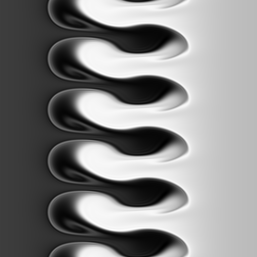
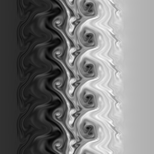

```python
%matplotlib inline
import matplotlib.pyplot as plt
import h5py as h5
import numpy as np
import dask
import dask.array as da
from PIL import Image
import glob
```


```python
import os  # library to get directory and file paths
import tarfile # this module makes possible to read and write tar archives

def extract_data(src, dest):
    datadir = os.path.join(dest)
    if not os.path.exists(datadir):
        print("Extracting data...")
        tar_path = os.path.join(src+'.tgz')
        with tarfile.open(tar_path, mode='r:gz') as data:
            data.extractall(dest)
         
extract_data('fvalues','data') 
```


```python
filenames = sorted(glob.glob("data/f*.h5"))
filenames[:5]
```


    ['data/f0001-values.h5',
     'data/f0002-values.h5',
     'data/f0003-values.h5',
     'data/f0004-values.h5',
     'data/f0005-values.h5']


```python
f = h5.File("data/f0499-values.h5", "r")
```


```python
list(f.keys())
```


    ['values']


```python
f.get("values")
```


    <HDF5 dataset "values": shape (257, 257), type "<f8">


```python
g = h5.File("polar-mesh.h5", "r")
x = g.get('x')
g = h5.File("polar-mesh.h5", "r")
y = g.get('y')
```


```python
z = f.get("values")
plt.contourf(x, y, z)
plt.axis('equal')
plt.tight_layout()
plt.axis('off');
```


```python
def save_plot( fn ):
    with h5.File(fn, "r") as f:
        dataset = "values"
        z = f.get(dataset)
        plt.contourf(x, y, z)
        plt.axis('equal')
        plt.tight_layout()
        plt.axis('off')
        plt.savefig(fn[-2:]+"png")
        plt.close()
```


```python
from tqdm.notebook import tqdm
from time import time

tinit = time()

for fn in tqdm(filenames):
    save_plot(fn)
    
serial_time = time()-tinit
```


    HBox(children=(FloatProgress(value=0.0, max=1000.0), HTML(value='')))


    


```python
from concurrent.futures import ProcessPoolExecutor

tinit = time()

with ProcessPoolExecutor(4) as pool:
    pool.map(save_plot, filenames)

parallel_time = time() - tinit
```


```python
serial_time / (4 * parallel_time) * 100 
```


    40.15887491897121


```python
def scale(x) :
    return np.uint8(255*(x-np.min(x)) / (np.max(x)-np.min(x)))


```


```python
def plot_image( fn ):
    with h5.File(fn, "r") as f:
        dataset = "values"
        z = f.get(dataset)
        return Image.fromarray(scale(z))

plot_image(filenames[499])
```





```python
from tqdm.notebook import tqdm
from PIL import Image

def create_image(fn):
    with h5.File(fn, "r") as f:
        dataset = "values"
        Z = f.get(dataset)
        return scale(Z)

def create_frames(filenames):

    return [create_image(fn) for fn in tqdm(filenames)]
    
frames = create_frames(filenames)
```


    HBox(children=(FloatProgress(value=0.0, max=1000.0), HTML(value='')))


    


```python
from ipywidgets import interact, IntSlider 
    
interact(lambda iframe: Image.fromarray(frames[iframe]), 
         iframe=IntSlider(min=0,
                          max=len(frames)-1,
                          step=1,
                          value=0, 
                          continuous_update=True))
```


    interactive(children=(IntSlider(value=0, description='iframe', max=999), Output()), _dom_classes=('widget-inte…


    <function __main__.<lambda>(iframe)>


```python
@dask.delayed
def read_frame(fn):
    with h5.File(fn, 'r') as f:
        d = f.get("values")[()]
        return scale(d)
    
read_frame(filenames[500])

def display_frame(array):
    return Image.fromarray(array)

display_frame(read_frame(filenames[-1]).compute())
```





```python
dask_arrays = []
for fn in filenames:
    array = da.from_delayed(read_frame(fn), 
                            shape=(257,257), dtype=np.uint8)
    dask_arrays.append(array)

values = da.stack(dask_arrays)  # concatenate arrays along first axis
```


```python
values
```


<table>
<tr>
<td>
<table>
  <thead>
    <tr><td> </td><th> Array </th><th> Chunk </th></tr>
  </thead>
  <tbody>
    <tr><th> Bytes </th><td> 66.05 MB </td> <td> 66.05 kB </td></tr>
    <tr><th> Shape </th><td> (1000, 257, 257) </td> <td> (1, 257, 257) </td></tr>
    <tr><th> Count </th><td> 3000 Tasks </td><td> 1000 Chunks </td></tr>
    <tr><th> Type </th><td> uint8 </td><td> numpy.ndarray </td></tr>
  </tbody>
</table>
</td>
<td>
<svg width="173" height="163" style="stroke:rgb(0,0,0);stroke-width:1" >

  <!-- Horizontal lines -->
  <line x1="10" y1="0" x2="80" y2="70" style="stroke-width:2" />
  <line x1="10" y1="43" x2="80" y2="113" style="stroke-width:2" />

  <!-- Vertical lines -->
  <line x1="10" y1="0" x2="10" y2="43" style="stroke-width:2" />
  <line x1="10" y1="0" x2="10" y2="43" />
  <line x1="10" y1="0" x2="10" y2="43" />
  <line x1="10" y1="0" x2="10" y2="43" />
  <line x1="10" y1="0" x2="10" y2="43" />
  <line x1="10" y1="0" x2="10" y2="43" />
  <line x1="10" y1="0" x2="10" y2="43" />
  <line x1="10" y1="0" x2="10" y2="43" />
  <line x1="10" y1="0" x2="10" y2="43" />
  <line x1="10" y1="0" x2="10" y2="43" />
  <line x1="10" y1="0" x2="10" y2="43" />
  <line x1="10" y1="0" x2="10" y2="43" />
  <line x1="10" y1="0" x2="10" y2="43" />
  <line x1="10" y1="0" x2="10" y2="43" />
  <line x1="10" y1="0" x2="10" y2="43" />
  <line x1="11" y1="1" x2="11" y2="44" />
  <line x1="11" y1="1" x2="11" y2="44" />
  <line x1="11" y1="1" x2="11" y2="44" />
  <line x1="11" y1="1" x2="11" y2="44" />
  <line x1="11" y1="1" x2="11" y2="44" />
  <line x1="11" y1="1" x2="11" y2="44" />
  <line x1="11" y1="1" x2="11" y2="44" />
  <line x1="11" y1="1" x2="11" y2="44" />
  <line x1="11" y1="1" x2="11" y2="44" />
  <line x1="11" y1="1" x2="11" y2="44" />
  <line x1="11" y1="1" x2="11" y2="44" />
  <line x1="11" y1="1" x2="11" y2="44" />
  <line x1="11" y1="1" x2="11" y2="44" />
  <line x1="11" y1="1" x2="11" y2="44" />
  <line x1="12" y1="2" x2="12" y2="45" />
  <line x1="12" y1="2" x2="12" y2="45" />
  <line x1="12" y1="2" x2="12" y2="45" />
  <line x1="12" y1="2" x2="12" y2="45" />
  <line x1="12" y1="2" x2="12" y2="45" />
  <line x1="12" y1="2" x2="12" y2="45" />
  <line x1="12" y1="2" x2="12" y2="45" />
  <line x1="12" y1="2" x2="12" y2="45" />
  <line x1="12" y1="2" x2="12" y2="45" />
  <line x1="12" y1="2" x2="12" y2="45" />
  <line x1="12" y1="2" x2="12" y2="45" />
  <line x1="12" y1="2" x2="12" y2="45" />
  <line x1="12" y1="2" x2="12" y2="45" />
  <line x1="12" y1="2" x2="12" y2="45" />
  <line x1="13" y1="3" x2="13" y2="46" />
  <line x1="13" y1="3" x2="13" y2="46" />
  <line x1="13" y1="3" x2="13" y2="46" />
  <line x1="13" y1="3" x2="13" y2="46" />
  <line x1="13" y1="3" x2="13" y2="46" />
  <line x1="13" y1="3" x2="13" y2="46" />
  <line x1="13" y1="3" x2="13" y2="46" />
  <line x1="13" y1="3" x2="13" y2="46" />
  <line x1="13" y1="3" x2="13" y2="46" />
  <line x1="13" y1="3" x2="13" y2="46" />
  <line x1="13" y1="3" x2="13" y2="46" />
  <line x1="13" y1="3" x2="13" y2="46" />
  <line x1="13" y1="3" x2="13" y2="46" />
  <line x1="13" y1="3" x2="13" y2="46" />
  <line x1="14" y1="4" x2="14" y2="47" />
  <line x1="14" y1="4" x2="14" y2="47" />
  <line x1="14" y1="4" x2="14" y2="47" />
  <line x1="14" y1="4" x2="14" y2="47" />
  <line x1="14" y1="4" x2="14" y2="47" />
  <line x1="14" y1="4" x2="14" y2="47" />
  <line x1="14" y1="4" x2="14" y2="47" />
  <line x1="14" y1="4" x2="14" y2="47" />
  <line x1="14" y1="4" x2="14" y2="47" />
  <line x1="14" y1="4" x2="14" y2="47" />
  <line x1="14" y1="4" x2="14" y2="47" />
  <line x1="14" y1="4" x2="14" y2="47" />
  <line x1="14" y1="4" x2="14" y2="47" />
  <line x1="14" y1="4" x2="14" y2="47" />
  <line x1="15" y1="5" x2="15" y2="48" />
  <line x1="15" y1="5" x2="15" y2="48" />
  <line x1="15" y1="5" x2="15" y2="48" />
  <line x1="15" y1="5" x2="15" y2="48" />
  <line x1="15" y1="5" x2="15" y2="48" />
  <line x1="15" y1="5" x2="15" y2="48" />
  <line x1="15" y1="5" x2="15" y2="48" />
  <line x1="15" y1="5" x2="15" y2="48" />
  <line x1="15" y1="5" x2="15" y2="48" />
  <line x1="15" y1="5" x2="15" y2="48" />
  <line x1="15" y1="5" x2="15" y2="48" />
  <line x1="15" y1="5" x2="15" y2="48" />
  <line x1="15" y1="5" x2="15" y2="48" />
  <line x1="15" y1="5" x2="15" y2="48" />
  <line x1="16" y1="6" x2="16" y2="49" />
  <line x1="16" y1="6" x2="16" y2="49" />
  <line x1="16" y1="6" x2="16" y2="49" />
  <line x1="16" y1="6" x2="16" y2="49" />
  <line x1="16" y1="6" x2="16" y2="49" />
  <line x1="16" y1="6" x2="16" y2="49" />
  <line x1="16" y1="6" x2="16" y2="49" />
  <line x1="16" y1="6" x2="16" y2="49" />
  <line x1="16" y1="6" x2="16" y2="49" />
  <line x1="16" y1="6" x2="16" y2="49" />
  <line x1="16" y1="6" x2="16" y2="49" />
  <line x1="16" y1="6" x2="16" y2="49" />
  <line x1="16" y1="6" x2="16" y2="49" />
  <line x1="16" y1="6" x2="16" y2="49" />
  <line x1="16" y1="6" x2="16" y2="49" />
  <line x1="17" y1="7" x2="17" y2="50" />
  <line x1="17" y1="7" x2="17" y2="50" />
  <line x1="17" y1="7" x2="17" y2="50" />
  <line x1="17" y1="7" x2="17" y2="50" />
  <line x1="17" y1="7" x2="17" y2="50" />
  <line x1="17" y1="7" x2="17" y2="50" />
  <line x1="17" y1="7" x2="17" y2="50" />
  <line x1="17" y1="7" x2="17" y2="50" />
  <line x1="17" y1="7" x2="17" y2="50" />
  <line x1="17" y1="7" x2="17" y2="50" />
  <line x1="17" y1="7" x2="17" y2="50" />
  <line x1="17" y1="7" x2="17" y2="50" />
  <line x1="17" y1="7" x2="17" y2="50" />
  <line x1="17" y1="7" x2="17" y2="50" />
  <line x1="18" y1="8" x2="18" y2="51" />
  <line x1="18" y1="8" x2="18" y2="51" />
  <line x1="18" y1="8" x2="18" y2="51" />
  <line x1="18" y1="8" x2="18" y2="51" />
  <line x1="18" y1="8" x2="18" y2="51" />
  <line x1="18" y1="8" x2="18" y2="51" />
  <line x1="18" y1="8" x2="18" y2="51" />
  <line x1="18" y1="8" x2="18" y2="51" />
  <line x1="18" y1="8" x2="18" y2="51" />
  <line x1="18" y1="8" x2="18" y2="51" />
  <line x1="18" y1="8" x2="18" y2="51" />
  <line x1="18" y1="8" x2="18" y2="51" />
  <line x1="18" y1="8" x2="18" y2="51" />
  <line x1="18" y1="8" x2="18" y2="51" />
  <line x1="19" y1="9" x2="19" y2="52" />
  <line x1="19" y1="9" x2="19" y2="52" />
  <line x1="19" y1="9" x2="19" y2="52" />
  <line x1="19" y1="9" x2="19" y2="52" />
  <line x1="19" y1="9" x2="19" y2="52" />
  <line x1="19" y1="9" x2="19" y2="52" />
  <line x1="19" y1="9" x2="19" y2="52" />
  <line x1="19" y1="9" x2="19" y2="52" />
  <line x1="19" y1="9" x2="19" y2="52" />
  <line x1="19" y1="9" x2="19" y2="52" />
  <line x1="19" y1="9" x2="19" y2="52" />
  <line x1="19" y1="9" x2="19" y2="52" />
  <line x1="19" y1="9" x2="19" y2="52" />
  <line x1="19" y1="9" x2="19" y2="52" />
  <line x1="20" y1="10" x2="20" y2="53" />
  <line x1="20" y1="10" x2="20" y2="53" />
  <line x1="20" y1="10" x2="20" y2="53" />
  <line x1="20" y1="10" x2="20" y2="53" />
  <line x1="20" y1="10" x2="20" y2="53" />
  <line x1="20" y1="10" x2="20" y2="53" />
  <line x1="20" y1="10" x2="20" y2="53" />
  <line x1="20" y1="10" x2="20" y2="53" />
  <line x1="20" y1="10" x2="20" y2="53" />
  <line x1="20" y1="10" x2="20" y2="53" />
  <line x1="20" y1="10" x2="20" y2="53" />
  <line x1="20" y1="10" x2="20" y2="53" />
  <line x1="20" y1="10" x2="20" y2="53" />
  <line x1="20" y1="10" x2="20" y2="53" />
  <line x1="21" y1="11" x2="21" y2="54" />
  <line x1="21" y1="11" x2="21" y2="54" />
  <line x1="21" y1="11" x2="21" y2="54" />
  <line x1="21" y1="11" x2="21" y2="54" />
  <line x1="21" y1="11" x2="21" y2="54" />
  <line x1="21" y1="11" x2="21" y2="54" />
  <line x1="21" y1="11" x2="21" y2="54" />
  <line x1="21" y1="11" x2="21" y2="54" />
  <line x1="21" y1="11" x2="21" y2="54" />
  <line x1="21" y1="11" x2="21" y2="54" />
  <line x1="21" y1="11" x2="21" y2="54" />
  <line x1="21" y1="11" x2="21" y2="54" />
  <line x1="21" y1="11" x2="21" y2="54" />
  <line x1="21" y1="11" x2="21" y2="54" />
  <line x1="22" y1="12" x2="22" y2="55" />
  <line x1="22" y1="12" x2="22" y2="55" />
  <line x1="22" y1="12" x2="22" y2="55" />
  <line x1="22" y1="12" x2="22" y2="55" />
  <line x1="22" y1="12" x2="22" y2="55" />
  <line x1="22" y1="12" x2="22" y2="55" />
  <line x1="22" y1="12" x2="22" y2="55" />
  <line x1="22" y1="12" x2="22" y2="55" />
  <line x1="22" y1="12" x2="22" y2="55" />
  <line x1="22" y1="12" x2="22" y2="55" />
  <line x1="22" y1="12" x2="22" y2="55" />
  <line x1="22" y1="12" x2="22" y2="55" />
  <line x1="22" y1="12" x2="22" y2="55" />
  <line x1="22" y1="12" x2="22" y2="55" />
  <line x1="22" y1="12" x2="22" y2="55" />
  <line x1="23" y1="13" x2="23" y2="56" />
  <line x1="23" y1="13" x2="23" y2="56" />
  <line x1="23" y1="13" x2="23" y2="56" />
  <line x1="23" y1="13" x2="23" y2="56" />
  <line x1="23" y1="13" x2="23" y2="56" />
  <line x1="23" y1="13" x2="23" y2="56" />
  <line x1="23" y1="13" x2="23" y2="56" />
  <line x1="23" y1="13" x2="23" y2="56" />
  <line x1="23" y1="13" x2="23" y2="56" />
  <line x1="23" y1="13" x2="23" y2="56" />
  <line x1="23" y1="13" x2="23" y2="56" />
  <line x1="23" y1="13" x2="23" y2="56" />
  <line x1="23" y1="13" x2="23" y2="56" />
  <line x1="23" y1="13" x2="23" y2="56" />
  <line x1="24" y1="14" x2="24" y2="57" />
  <line x1="24" y1="14" x2="24" y2="57" />
  <line x1="24" y1="14" x2="24" y2="57" />
  <line x1="24" y1="14" x2="24" y2="57" />
  <line x1="24" y1="14" x2="24" y2="57" />
  <line x1="24" y1="14" x2="24" y2="57" />
  <line x1="24" y1="14" x2="24" y2="57" />
  <line x1="24" y1="14" x2="24" y2="57" />
  <line x1="24" y1="14" x2="24" y2="57" />
  <line x1="24" y1="14" x2="24" y2="57" />
  <line x1="24" y1="14" x2="24" y2="57" />
  <line x1="24" y1="14" x2="24" y2="57" />
  <line x1="24" y1="14" x2="24" y2="57" />
  <line x1="24" y1="14" x2="24" y2="57" />
  <line x1="25" y1="15" x2="25" y2="58" />
  <line x1="25" y1="15" x2="25" y2="58" />
  <line x1="25" y1="15" x2="25" y2="58" />
  <line x1="25" y1="15" x2="25" y2="58" />
  <line x1="25" y1="15" x2="25" y2="58" />
  <line x1="25" y1="15" x2="25" y2="58" />
  <line x1="25" y1="15" x2="25" y2="58" />
  <line x1="25" y1="15" x2="25" y2="58" />
  <line x1="25" y1="15" x2="25" y2="58" />
  <line x1="25" y1="15" x2="25" y2="58" />
  <line x1="25" y1="15" x2="25" y2="58" />
  <line x1="25" y1="15" x2="25" y2="58" />
  <line x1="25" y1="15" x2="25" y2="58" />
  <line x1="25" y1="15" x2="25" y2="58" />
  <line x1="26" y1="16" x2="26" y2="59" />
  <line x1="26" y1="16" x2="26" y2="59" />
  <line x1="26" y1="16" x2="26" y2="59" />
  <line x1="26" y1="16" x2="26" y2="59" />
  <line x1="26" y1="16" x2="26" y2="59" />
  <line x1="26" y1="16" x2="26" y2="59" />
  <line x1="26" y1="16" x2="26" y2="59" />
  <line x1="26" y1="16" x2="26" y2="59" />
  <line x1="26" y1="16" x2="26" y2="59" />
  <line x1="26" y1="16" x2="26" y2="59" />
  <line x1="26" y1="16" x2="26" y2="59" />
  <line x1="26" y1="16" x2="26" y2="59" />
  <line x1="26" y1="16" x2="26" y2="59" />
  <line x1="26" y1="16" x2="26" y2="59" />
  <line x1="27" y1="17" x2="27" y2="60" />
  <line x1="27" y1="17" x2="27" y2="60" />
  <line x1="27" y1="17" x2="27" y2="60" />
  <line x1="27" y1="17" x2="27" y2="60" />
  <line x1="27" y1="17" x2="27" y2="60" />
  <line x1="27" y1="17" x2="27" y2="60" />
  <line x1="27" y1="17" x2="27" y2="60" />
  <line x1="27" y1="17" x2="27" y2="60" />
  <line x1="27" y1="17" x2="27" y2="60" />
  <line x1="27" y1="17" x2="27" y2="60" />
  <line x1="27" y1="17" x2="27" y2="60" />
  <line x1="27" y1="17" x2="27" y2="60" />
  <line x1="27" y1="17" x2="27" y2="60" />
  <line x1="27" y1="17" x2="27" y2="60" />
  <line x1="28" y1="18" x2="28" y2="61" />
  <line x1="28" y1="18" x2="28" y2="61" />
  <line x1="28" y1="18" x2="28" y2="61" />
  <line x1="28" y1="18" x2="28" y2="61" />
  <line x1="28" y1="18" x2="28" y2="61" />
  <line x1="28" y1="18" x2="28" y2="61" />
  <line x1="28" y1="18" x2="28" y2="61" />
  <line x1="28" y1="18" x2="28" y2="61" />
  <line x1="28" y1="18" x2="28" y2="61" />
  <line x1="28" y1="18" x2="28" y2="61" />
  <line x1="28" y1="18" x2="28" y2="61" />
  <line x1="28" y1="18" x2="28" y2="61" />
  <line x1="28" y1="18" x2="28" y2="61" />
  <line x1="28" y1="18" x2="28" y2="61" />
  <line x1="28" y1="18" x2="28" y2="61" />
  <line x1="29" y1="19" x2="29" y2="62" />
  <line x1="29" y1="19" x2="29" y2="62" />
  <line x1="29" y1="19" x2="29" y2="62" />
  <line x1="29" y1="19" x2="29" y2="62" />
  <line x1="29" y1="19" x2="29" y2="62" />
  <line x1="29" y1="19" x2="29" y2="62" />
  <line x1="29" y1="19" x2="29" y2="62" />
  <line x1="29" y1="19" x2="29" y2="62" />
  <line x1="29" y1="19" x2="29" y2="62" />
  <line x1="29" y1="19" x2="29" y2="62" />
  <line x1="29" y1="19" x2="29" y2="62" />
  <line x1="29" y1="19" x2="29" y2="62" />
  <line x1="29" y1="19" x2="29" y2="62" />
  <line x1="29" y1="19" x2="29" y2="62" />
  <line x1="30" y1="20" x2="30" y2="63" />
  <line x1="30" y1="20" x2="30" y2="63" />
  <line x1="30" y1="20" x2="30" y2="63" />
  <line x1="30" y1="20" x2="30" y2="63" />
  <line x1="30" y1="20" x2="30" y2="63" />
  <line x1="30" y1="20" x2="30" y2="63" />
  <line x1="30" y1="20" x2="30" y2="63" />
  <line x1="30" y1="20" x2="30" y2="63" />
  <line x1="30" y1="20" x2="30" y2="63" />
  <line x1="30" y1="20" x2="30" y2="63" />
  <line x1="30" y1="20" x2="30" y2="63" />
  <line x1="30" y1="20" x2="30" y2="63" />
  <line x1="30" y1="20" x2="30" y2="63" />
  <line x1="30" y1="20" x2="30" y2="63" />
  <line x1="31" y1="21" x2="31" y2="64" />
  <line x1="31" y1="21" x2="31" y2="64" />
  <line x1="31" y1="21" x2="31" y2="64" />
  <line x1="31" y1="21" x2="31" y2="64" />
  <line x1="31" y1="21" x2="31" y2="64" />
  <line x1="31" y1="21" x2="31" y2="64" />
  <line x1="31" y1="21" x2="31" y2="64" />
  <line x1="31" y1="21" x2="31" y2="64" />
  <line x1="31" y1="21" x2="31" y2="64" />
  <line x1="31" y1="21" x2="31" y2="64" />
  <line x1="31" y1="21" x2="31" y2="64" />
  <line x1="31" y1="21" x2="31" y2="64" />
  <line x1="31" y1="21" x2="31" y2="64" />
  <line x1="31" y1="21" x2="31" y2="64" />
  <line x1="32" y1="22" x2="32" y2="65" />
  <line x1="32" y1="22" x2="32" y2="65" />
  <line x1="32" y1="22" x2="32" y2="65" />
  <line x1="32" y1="22" x2="32" y2="65" />
  <line x1="32" y1="22" x2="32" y2="65" />
  <line x1="32" y1="22" x2="32" y2="65" />
  <line x1="32" y1="22" x2="32" y2="65" />
  <line x1="32" y1="22" x2="32" y2="65" />
  <line x1="32" y1="22" x2="32" y2="65" />
  <line x1="32" y1="22" x2="32" y2="65" />
  <line x1="32" y1="22" x2="32" y2="65" />
  <line x1="32" y1="22" x2="32" y2="65" />
  <line x1="32" y1="22" x2="32" y2="65" />
  <line x1="32" y1="22" x2="32" y2="65" />
  <line x1="33" y1="23" x2="33" y2="66" />
  <line x1="33" y1="23" x2="33" y2="66" />
  <line x1="33" y1="23" x2="33" y2="66" />
  <line x1="33" y1="23" x2="33" y2="66" />
  <line x1="33" y1="23" x2="33" y2="66" />
  <line x1="33" y1="23" x2="33" y2="66" />
  <line x1="33" y1="23" x2="33" y2="66" />
  <line x1="33" y1="23" x2="33" y2="66" />
  <line x1="33" y1="23" x2="33" y2="66" />
  <line x1="33" y1="23" x2="33" y2="66" />
  <line x1="33" y1="23" x2="33" y2="66" />
  <line x1="33" y1="23" x2="33" y2="66" />
  <line x1="33" y1="23" x2="33" y2="66" />
  <line x1="33" y1="23" x2="33" y2="66" />
  <line x1="34" y1="24" x2="34" y2="67" />
  <line x1="34" y1="24" x2="34" y2="67" />
  <line x1="34" y1="24" x2="34" y2="67" />
  <line x1="34" y1="24" x2="34" y2="67" />
  <line x1="34" y1="24" x2="34" y2="67" />
  <line x1="34" y1="24" x2="34" y2="67" />
  <line x1="34" y1="24" x2="34" y2="67" />
  <line x1="34" y1="24" x2="34" y2="67" />
  <line x1="34" y1="24" x2="34" y2="67" />
  <line x1="34" y1="24" x2="34" y2="67" />
  <line x1="34" y1="24" x2="34" y2="67" />
  <line x1="34" y1="24" x2="34" y2="67" />
  <line x1="34" y1="24" x2="34" y2="67" />
  <line x1="34" y1="24" x2="34" y2="67" />
  <line x1="34" y1="24" x2="34" y2="67" />
  <line x1="35" y1="25" x2="35" y2="68" />
  <line x1="35" y1="25" x2="35" y2="68" />
  <line x1="35" y1="25" x2="35" y2="68" />
  <line x1="35" y1="25" x2="35" y2="68" />
  <line x1="35" y1="25" x2="35" y2="68" />
  <line x1="35" y1="25" x2="35" y2="68" />
  <line x1="35" y1="25" x2="35" y2="68" />
  <line x1="35" y1="25" x2="35" y2="68" />
  <line x1="35" y1="25" x2="35" y2="68" />
  <line x1="35" y1="25" x2="35" y2="68" />
  <line x1="35" y1="25" x2="35" y2="68" />
  <line x1="35" y1="25" x2="35" y2="68" />
  <line x1="35" y1="25" x2="35" y2="68" />
  <line x1="35" y1="25" x2="35" y2="68" />
  <line x1="36" y1="26" x2="36" y2="69" />
  <line x1="36" y1="26" x2="36" y2="69" />
  <line x1="36" y1="26" x2="36" y2="69" />
  <line x1="36" y1="26" x2="36" y2="69" />
  <line x1="36" y1="26" x2="36" y2="69" />
  <line x1="36" y1="26" x2="36" y2="69" />
  <line x1="36" y1="26" x2="36" y2="69" />
  <line x1="36" y1="26" x2="36" y2="69" />
  <line x1="36" y1="26" x2="36" y2="69" />
  <line x1="36" y1="26" x2="36" y2="69" />
  <line x1="36" y1="26" x2="36" y2="69" />
  <line x1="36" y1="26" x2="36" y2="69" />
  <line x1="36" y1="26" x2="36" y2="69" />
  <line x1="36" y1="26" x2="36" y2="69" />
  <line x1="37" y1="27" x2="37" y2="70" />
  <line x1="37" y1="27" x2="37" y2="70" />
  <line x1="37" y1="27" x2="37" y2="70" />
  <line x1="37" y1="27" x2="37" y2="70" />
  <line x1="37" y1="27" x2="37" y2="70" />
  <line x1="37" y1="27" x2="37" y2="70" />
  <line x1="37" y1="27" x2="37" y2="70" />
  <line x1="37" y1="27" x2="37" y2="70" />
  <line x1="37" y1="27" x2="37" y2="70" />
  <line x1="37" y1="27" x2="37" y2="70" />
  <line x1="37" y1="27" x2="37" y2="70" />
  <line x1="37" y1="27" x2="37" y2="70" />
  <line x1="37" y1="27" x2="37" y2="70" />
  <line x1="37" y1="27" x2="37" y2="70" />
  <line x1="38" y1="28" x2="38" y2="71" />
  <line x1="38" y1="28" x2="38" y2="71" />
  <line x1="38" y1="28" x2="38" y2="71" />
  <line x1="38" y1="28" x2="38" y2="71" />
  <line x1="38" y1="28" x2="38" y2="71" />
  <line x1="38" y1="28" x2="38" y2="71" />
  <line x1="38" y1="28" x2="38" y2="71" />
  <line x1="38" y1="28" x2="38" y2="71" />
  <line x1="38" y1="28" x2="38" y2="71" />
  <line x1="38" y1="28" x2="38" y2="71" />
  <line x1="38" y1="28" x2="38" y2="71" />
  <line x1="38" y1="28" x2="38" y2="71" />
  <line x1="38" y1="28" x2="38" y2="71" />
  <line x1="38" y1="28" x2="38" y2="71" />
  <line x1="39" y1="29" x2="39" y2="72" />
  <line x1="39" y1="29" x2="39" y2="72" />
  <line x1="39" y1="29" x2="39" y2="72" />
  <line x1="39" y1="29" x2="39" y2="72" />
  <line x1="39" y1="29" x2="39" y2="72" />
  <line x1="39" y1="29" x2="39" y2="72" />
  <line x1="39" y1="29" x2="39" y2="72" />
  <line x1="39" y1="29" x2="39" y2="72" />
  <line x1="39" y1="29" x2="39" y2="72" />
  <line x1="39" y1="29" x2="39" y2="72" />
  <line x1="39" y1="29" x2="39" y2="72" />
  <line x1="39" y1="29" x2="39" y2="72" />
  <line x1="39" y1="29" x2="39" y2="72" />
  <line x1="39" y1="29" x2="39" y2="72" />
  <line x1="40" y1="30" x2="40" y2="73" />
  <line x1="40" y1="30" x2="40" y2="73" />
  <line x1="40" y1="30" x2="40" y2="73" />
  <line x1="40" y1="30" x2="40" y2="73" />
  <line x1="40" y1="30" x2="40" y2="73" />
  <line x1="40" y1="30" x2="40" y2="73" />
  <line x1="40" y1="30" x2="40" y2="73" />
  <line x1="40" y1="30" x2="40" y2="73" />
  <line x1="40" y1="30" x2="40" y2="73" />
  <line x1="40" y1="30" x2="40" y2="73" />
  <line x1="40" y1="30" x2="40" y2="73" />
  <line x1="40" y1="30" x2="40" y2="73" />
  <line x1="40" y1="30" x2="40" y2="73" />
  <line x1="40" y1="30" x2="40" y2="73" />
  <line x1="40" y1="30" x2="40" y2="73" />
  <line x1="41" y1="31" x2="41" y2="74" />
  <line x1="41" y1="31" x2="41" y2="74" />
  <line x1="41" y1="31" x2="41" y2="74" />
  <line x1="41" y1="31" x2="41" y2="74" />
  <line x1="41" y1="31" x2="41" y2="74" />
  <line x1="41" y1="31" x2="41" y2="74" />
  <line x1="41" y1="31" x2="41" y2="74" />
  <line x1="41" y1="31" x2="41" y2="74" />
  <line x1="41" y1="31" x2="41" y2="74" />
  <line x1="41" y1="31" x2="41" y2="74" />
  <line x1="41" y1="31" x2="41" y2="74" />
  <line x1="41" y1="31" x2="41" y2="74" />
  <line x1="41" y1="31" x2="41" y2="74" />
  <line x1="41" y1="31" x2="41" y2="74" />
  <line x1="42" y1="32" x2="42" y2="75" />
  <line x1="42" y1="32" x2="42" y2="75" />
  <line x1="42" y1="32" x2="42" y2="75" />
  <line x1="42" y1="32" x2="42" y2="75" />
  <line x1="42" y1="32" x2="42" y2="75" />
  <line x1="42" y1="32" x2="42" y2="75" />
  <line x1="42" y1="32" x2="42" y2="75" />
  <line x1="42" y1="32" x2="42" y2="75" />
  <line x1="42" y1="32" x2="42" y2="75" />
  <line x1="42" y1="32" x2="42" y2="75" />
  <line x1="42" y1="32" x2="42" y2="75" />
  <line x1="42" y1="32" x2="42" y2="75" />
  <line x1="42" y1="32" x2="42" y2="75" />
  <line x1="42" y1="32" x2="42" y2="75" />
  <line x1="43" y1="33" x2="43" y2="76" />
  <line x1="43" y1="33" x2="43" y2="76" />
  <line x1="43" y1="33" x2="43" y2="76" />
  <line x1="43" y1="33" x2="43" y2="76" />
  <line x1="43" y1="33" x2="43" y2="76" />
  <line x1="43" y1="33" x2="43" y2="76" />
  <line x1="43" y1="33" x2="43" y2="76" />
  <line x1="43" y1="33" x2="43" y2="76" />
  <line x1="43" y1="33" x2="43" y2="76" />
  <line x1="43" y1="33" x2="43" y2="76" />
  <line x1="43" y1="33" x2="43" y2="76" />
  <line x1="43" y1="33" x2="43" y2="76" />
  <line x1="43" y1="33" x2="43" y2="76" />
  <line x1="43" y1="33" x2="43" y2="76" />
  <line x1="44" y1="34" x2="44" y2="77" />
  <line x1="44" y1="34" x2="44" y2="77" />
  <line x1="44" y1="34" x2="44" y2="77" />
  <line x1="44" y1="34" x2="44" y2="77" />
  <line x1="44" y1="34" x2="44" y2="77" />
  <line x1="44" y1="34" x2="44" y2="77" />
  <line x1="44" y1="34" x2="44" y2="77" />
  <line x1="44" y1="34" x2="44" y2="77" />
  <line x1="44" y1="34" x2="44" y2="77" />
  <line x1="44" y1="34" x2="44" y2="77" />
  <line x1="44" y1="34" x2="44" y2="77" />
  <line x1="44" y1="34" x2="44" y2="77" />
  <line x1="44" y1="34" x2="44" y2="77" />
  <line x1="44" y1="34" x2="44" y2="77" />
  <line x1="45" y1="35" x2="45" y2="78" />
  <line x1="45" y1="35" x2="45" y2="78" />
  <line x1="45" y1="35" x2="45" y2="78" />
  <line x1="45" y1="35" x2="45" y2="78" />
  <line x1="45" y1="35" x2="45" y2="78" />
  <line x1="45" y1="35" x2="45" y2="78" />
  <line x1="45" y1="35" x2="45" y2="78" />
  <line x1="45" y1="35" x2="45" y2="78" />
  <line x1="45" y1="35" x2="45" y2="78" />
  <line x1="45" y1="35" x2="45" y2="78" />
  <line x1="45" y1="35" x2="45" y2="78" />
  <line x1="45" y1="35" x2="45" y2="78" />
  <line x1="45" y1="35" x2="45" y2="78" />
  <line x1="45" y1="35" x2="45" y2="78" />
  <line x1="46" y1="36" x2="46" y2="79" />
  <line x1="46" y1="36" x2="46" y2="79" />
  <line x1="46" y1="36" x2="46" y2="79" />
  <line x1="46" y1="36" x2="46" y2="79" />
  <line x1="46" y1="36" x2="46" y2="79" />
  <line x1="46" y1="36" x2="46" y2="79" />
  <line x1="46" y1="36" x2="46" y2="79" />
  <line x1="46" y1="36" x2="46" y2="79" />
  <line x1="46" y1="36" x2="46" y2="79" />
  <line x1="46" y1="36" x2="46" y2="79" />
  <line x1="46" y1="36" x2="46" y2="79" />
  <line x1="46" y1="36" x2="46" y2="79" />
  <line x1="46" y1="36" x2="46" y2="79" />
  <line x1="46" y1="36" x2="46" y2="79" />
  <line x1="46" y1="36" x2="46" y2="79" />
  <line x1="47" y1="37" x2="47" y2="80" />
  <line x1="47" y1="37" x2="47" y2="80" />
  <line x1="47" y1="37" x2="47" y2="80" />
  <line x1="47" y1="37" x2="47" y2="80" />
  <line x1="47" y1="37" x2="47" y2="80" />
  <line x1="47" y1="37" x2="47" y2="80" />
  <line x1="47" y1="37" x2="47" y2="80" />
  <line x1="47" y1="37" x2="47" y2="80" />
  <line x1="47" y1="37" x2="47" y2="80" />
  <line x1="47" y1="37" x2="47" y2="80" />
  <line x1="47" y1="37" x2="47" y2="80" />
  <line x1="47" y1="37" x2="47" y2="80" />
  <line x1="47" y1="37" x2="47" y2="80" />
  <line x1="47" y1="37" x2="47" y2="80" />
  <line x1="48" y1="38" x2="48" y2="81" />
  <line x1="48" y1="38" x2="48" y2="81" />
  <line x1="48" y1="38" x2="48" y2="81" />
  <line x1="48" y1="38" x2="48" y2="81" />
  <line x1="48" y1="38" x2="48" y2="81" />
  <line x1="48" y1="38" x2="48" y2="81" />
  <line x1="48" y1="38" x2="48" y2="81" />
  <line x1="48" y1="38" x2="48" y2="81" />
  <line x1="48" y1="38" x2="48" y2="81" />
  <line x1="48" y1="38" x2="48" y2="81" />
  <line x1="48" y1="38" x2="48" y2="81" />
  <line x1="48" y1="38" x2="48" y2="81" />
  <line x1="48" y1="38" x2="48" y2="81" />
  <line x1="48" y1="38" x2="48" y2="81" />
  <line x1="49" y1="39" x2="49" y2="82" />
  <line x1="49" y1="39" x2="49" y2="82" />
  <line x1="49" y1="39" x2="49" y2="82" />
  <line x1="49" y1="39" x2="49" y2="82" />
  <line x1="49" y1="39" x2="49" y2="82" />
  <line x1="49" y1="39" x2="49" y2="82" />
  <line x1="49" y1="39" x2="49" y2="82" />
  <line x1="49" y1="39" x2="49" y2="82" />
  <line x1="49" y1="39" x2="49" y2="82" />
  <line x1="49" y1="39" x2="49" y2="82" />
  <line x1="49" y1="39" x2="49" y2="82" />
  <line x1="49" y1="39" x2="49" y2="82" />
  <line x1="49" y1="39" x2="49" y2="82" />
  <line x1="49" y1="39" x2="49" y2="82" />
  <line x1="50" y1="40" x2="50" y2="83" />
  <line x1="50" y1="40" x2="50" y2="83" />
  <line x1="50" y1="40" x2="50" y2="83" />
  <line x1="50" y1="40" x2="50" y2="83" />
  <line x1="50" y1="40" x2="50" y2="83" />
  <line x1="50" y1="40" x2="50" y2="83" />
  <line x1="50" y1="40" x2="50" y2="83" />
  <line x1="50" y1="40" x2="50" y2="83" />
  <line x1="50" y1="40" x2="50" y2="83" />
  <line x1="50" y1="40" x2="50" y2="83" />
  <line x1="50" y1="40" x2="50" y2="83" />
  <line x1="50" y1="40" x2="50" y2="83" />
  <line x1="50" y1="40" x2="50" y2="83" />
  <line x1="50" y1="40" x2="50" y2="83" />
  <line x1="51" y1="41" x2="51" y2="84" />
  <line x1="51" y1="41" x2="51" y2="84" />
  <line x1="51" y1="41" x2="51" y2="84" />
  <line x1="51" y1="41" x2="51" y2="84" />
  <line x1="51" y1="41" x2="51" y2="84" />
  <line x1="51" y1="41" x2="51" y2="84" />
  <line x1="51" y1="41" x2="51" y2="84" />
  <line x1="51" y1="41" x2="51" y2="84" />
  <line x1="51" y1="41" x2="51" y2="84" />
  <line x1="51" y1="41" x2="51" y2="84" />
  <line x1="51" y1="41" x2="51" y2="84" />
  <line x1="51" y1="41" x2="51" y2="84" />
  <line x1="51" y1="41" x2="51" y2="84" />
  <line x1="51" y1="41" x2="51" y2="84" />
  <line x1="52" y1="42" x2="52" y2="85" />
  <line x1="52" y1="42" x2="52" y2="85" />
  <line x1="52" y1="42" x2="52" y2="85" />
  <line x1="52" y1="42" x2="52" y2="85" />
  <line x1="52" y1="42" x2="52" y2="85" />
  <line x1="52" y1="42" x2="52" y2="85" />
  <line x1="52" y1="42" x2="52" y2="85" />
  <line x1="52" y1="42" x2="52" y2="85" />
  <line x1="52" y1="42" x2="52" y2="85" />
  <line x1="52" y1="42" x2="52" y2="85" />
  <line x1="52" y1="42" x2="52" y2="85" />
  <line x1="52" y1="42" x2="52" y2="85" />
  <line x1="52" y1="42" x2="52" y2="85" />
  <line x1="52" y1="42" x2="52" y2="85" />
  <line x1="52" y1="42" x2="52" y2="85" />
  <line x1="53" y1="43" x2="53" y2="86" />
  <line x1="53" y1="43" x2="53" y2="86" />
  <line x1="53" y1="43" x2="53" y2="86" />
  <line x1="53" y1="43" x2="53" y2="86" />
  <line x1="53" y1="43" x2="53" y2="86" />
  <line x1="53" y1="43" x2="53" y2="86" />
  <line x1="53" y1="43" x2="53" y2="86" />
  <line x1="53" y1="43" x2="53" y2="86" />
  <line x1="53" y1="43" x2="53" y2="86" />
  <line x1="53" y1="43" x2="53" y2="86" />
  <line x1="53" y1="43" x2="53" y2="86" />
  <line x1="53" y1="43" x2="53" y2="86" />
  <line x1="53" y1="43" x2="53" y2="86" />
  <line x1="53" y1="43" x2="53" y2="86" />
  <line x1="54" y1="44" x2="54" y2="87" />
  <line x1="54" y1="44" x2="54" y2="87" />
  <line x1="54" y1="44" x2="54" y2="87" />
  <line x1="54" y1="44" x2="54" y2="87" />
  <line x1="54" y1="44" x2="54" y2="87" />
  <line x1="54" y1="44" x2="54" y2="87" />
  <line x1="54" y1="44" x2="54" y2="87" />
  <line x1="54" y1="44" x2="54" y2="87" />
  <line x1="54" y1="44" x2="54" y2="87" />
  <line x1="54" y1="44" x2="54" y2="87" />
  <line x1="54" y1="44" x2="54" y2="87" />
  <line x1="54" y1="44" x2="54" y2="87" />
  <line x1="54" y1="44" x2="54" y2="87" />
  <line x1="54" y1="44" x2="54" y2="87" />
  <line x1="55" y1="45" x2="55" y2="88" />
  <line x1="55" y1="45" x2="55" y2="88" />
  <line x1="55" y1="45" x2="55" y2="88" />
  <line x1="55" y1="45" x2="55" y2="88" />
  <line x1="55" y1="45" x2="55" y2="88" />
  <line x1="55" y1="45" x2="55" y2="88" />
  <line x1="55" y1="45" x2="55" y2="88" />
  <line x1="55" y1="45" x2="55" y2="88" />
  <line x1="55" y1="45" x2="55" y2="88" />
  <line x1="55" y1="45" x2="55" y2="88" />
  <line x1="55" y1="45" x2="55" y2="88" />
  <line x1="55" y1="45" x2="55" y2="88" />
  <line x1="55" y1="45" x2="55" y2="88" />
  <line x1="55" y1="45" x2="55" y2="88" />
  <line x1="56" y1="46" x2="56" y2="89" />
  <line x1="56" y1="46" x2="56" y2="89" />
  <line x1="56" y1="46" x2="56" y2="89" />
  <line x1="56" y1="46" x2="56" y2="89" />
  <line x1="56" y1="46" x2="56" y2="89" />
  <line x1="56" y1="46" x2="56" y2="89" />
  <line x1="56" y1="46" x2="56" y2="89" />
  <line x1="56" y1="46" x2="56" y2="89" />
  <line x1="56" y1="46" x2="56" y2="89" />
  <line x1="56" y1="46" x2="56" y2="89" />
  <line x1="56" y1="46" x2="56" y2="89" />
  <line x1="56" y1="46" x2="56" y2="89" />
  <line x1="56" y1="46" x2="56" y2="89" />
  <line x1="56" y1="46" x2="56" y2="89" />
  <line x1="57" y1="47" x2="57" y2="90" />
  <line x1="57" y1="47" x2="57" y2="90" />
  <line x1="57" y1="47" x2="57" y2="90" />
  <line x1="57" y1="47" x2="57" y2="90" />
  <line x1="57" y1="47" x2="57" y2="90" />
  <line x1="57" y1="47" x2="57" y2="90" />
  <line x1="57" y1="47" x2="57" y2="90" />
  <line x1="57" y1="47" x2="57" y2="90" />
  <line x1="57" y1="47" x2="57" y2="90" />
  <line x1="57" y1="47" x2="57" y2="90" />
  <line x1="57" y1="47" x2="57" y2="90" />
  <line x1="57" y1="47" x2="57" y2="90" />
  <line x1="57" y1="47" x2="57" y2="90" />
  <line x1="57" y1="47" x2="57" y2="90" />
  <line x1="58" y1="48" x2="58" y2="91" />
  <line x1="58" y1="48" x2="58" y2="91" />
  <line x1="58" y1="48" x2="58" y2="91" />
  <line x1="58" y1="48" x2="58" y2="91" />
  <line x1="58" y1="48" x2="58" y2="91" />
  <line x1="58" y1="48" x2="58" y2="91" />
  <line x1="58" y1="48" x2="58" y2="91" />
  <line x1="58" y1="48" x2="58" y2="91" />
  <line x1="58" y1="48" x2="58" y2="91" />
  <line x1="58" y1="48" x2="58" y2="91" />
  <line x1="58" y1="48" x2="58" y2="91" />
  <line x1="58" y1="48" x2="58" y2="91" />
  <line x1="58" y1="48" x2="58" y2="91" />
  <line x1="58" y1="48" x2="58" y2="91" />
  <line x1="58" y1="48" x2="58" y2="91" />
  <line x1="59" y1="49" x2="59" y2="92" />
  <line x1="59" y1="49" x2="59" y2="92" />
  <line x1="59" y1="49" x2="59" y2="92" />
  <line x1="59" y1="49" x2="59" y2="92" />
  <line x1="59" y1="49" x2="59" y2="92" />
  <line x1="59" y1="49" x2="59" y2="92" />
  <line x1="59" y1="49" x2="59" y2="92" />
  <line x1="59" y1="49" x2="59" y2="92" />
  <line x1="59" y1="49" x2="59" y2="92" />
  <line x1="59" y1="49" x2="59" y2="92" />
  <line x1="59" y1="49" x2="59" y2="92" />
  <line x1="59" y1="49" x2="59" y2="92" />
  <line x1="59" y1="49" x2="59" y2="92" />
  <line x1="59" y1="49" x2="59" y2="92" />
  <line x1="60" y1="50" x2="60" y2="93" />
  <line x1="60" y1="50" x2="60" y2="93" />
  <line x1="60" y1="50" x2="60" y2="93" />
  <line x1="60" y1="50" x2="60" y2="93" />
  <line x1="60" y1="50" x2="60" y2="93" />
  <line x1="60" y1="50" x2="60" y2="93" />
  <line x1="60" y1="50" x2="60" y2="93" />
  <line x1="60" y1="50" x2="60" y2="93" />
  <line x1="60" y1="50" x2="60" y2="93" />
  <line x1="60" y1="50" x2="60" y2="93" />
  <line x1="60" y1="50" x2="60" y2="93" />
  <line x1="60" y1="50" x2="60" y2="93" />
  <line x1="60" y1="50" x2="60" y2="93" />
  <line x1="60" y1="50" x2="60" y2="93" />
  <line x1="61" y1="51" x2="61" y2="94" />
  <line x1="61" y1="51" x2="61" y2="94" />
  <line x1="61" y1="51" x2="61" y2="94" />
  <line x1="61" y1="51" x2="61" y2="94" />
  <line x1="61" y1="51" x2="61" y2="94" />
  <line x1="61" y1="51" x2="61" y2="94" />
  <line x1="61" y1="51" x2="61" y2="94" />
  <line x1="61" y1="51" x2="61" y2="94" />
  <line x1="61" y1="51" x2="61" y2="94" />
  <line x1="61" y1="51" x2="61" y2="94" />
  <line x1="61" y1="51" x2="61" y2="94" />
  <line x1="61" y1="51" x2="61" y2="94" />
  <line x1="61" y1="51" x2="61" y2="94" />
  <line x1="61" y1="51" x2="61" y2="94" />
  <line x1="62" y1="52" x2="62" y2="95" />
  <line x1="62" y1="52" x2="62" y2="95" />
  <line x1="62" y1="52" x2="62" y2="95" />
  <line x1="62" y1="52" x2="62" y2="95" />
  <line x1="62" y1="52" x2="62" y2="95" />
  <line x1="62" y1="52" x2="62" y2="95" />
  <line x1="62" y1="52" x2="62" y2="95" />
  <line x1="62" y1="52" x2="62" y2="95" />
  <line x1="62" y1="52" x2="62" y2="95" />
  <line x1="62" y1="52" x2="62" y2="95" />
  <line x1="62" y1="52" x2="62" y2="95" />
  <line x1="62" y1="52" x2="62" y2="95" />
  <line x1="62" y1="52" x2="62" y2="95" />
  <line x1="62" y1="52" x2="62" y2="95" />
  <line x1="63" y1="53" x2="63" y2="96" />
  <line x1="63" y1="53" x2="63" y2="96" />
  <line x1="63" y1="53" x2="63" y2="96" />
  <line x1="63" y1="53" x2="63" y2="96" />
  <line x1="63" y1="53" x2="63" y2="96" />
  <line x1="63" y1="53" x2="63" y2="96" />
  <line x1="63" y1="53" x2="63" y2="96" />
  <line x1="63" y1="53" x2="63" y2="96" />
  <line x1="63" y1="53" x2="63" y2="96" />
  <line x1="63" y1="53" x2="63" y2="96" />
  <line x1="63" y1="53" x2="63" y2="96" />
  <line x1="63" y1="53" x2="63" y2="96" />
  <line x1="63" y1="53" x2="63" y2="96" />
  <line x1="63" y1="53" x2="63" y2="96" />
  <line x1="64" y1="54" x2="64" y2="97" />
  <line x1="64" y1="54" x2="64" y2="97" />
  <line x1="64" y1="54" x2="64" y2="97" />
  <line x1="64" y1="54" x2="64" y2="97" />
  <line x1="64" y1="54" x2="64" y2="97" />
  <line x1="64" y1="54" x2="64" y2="97" />
  <line x1="64" y1="54" x2="64" y2="97" />
  <line x1="64" y1="54" x2="64" y2="97" />
  <line x1="64" y1="54" x2="64" y2="97" />
  <line x1="64" y1="54" x2="64" y2="97" />
  <line x1="64" y1="54" x2="64" y2="97" />
  <line x1="64" y1="54" x2="64" y2="97" />
  <line x1="64" y1="54" x2="64" y2="97" />
  <line x1="64" y1="54" x2="64" y2="97" />
  <line x1="64" y1="54" x2="64" y2="97" />
  <line x1="65" y1="55" x2="65" y2="98" />
  <line x1="65" y1="55" x2="65" y2="98" />
  <line x1="65" y1="55" x2="65" y2="98" />
  <line x1="65" y1="55" x2="65" y2="98" />
  <line x1="65" y1="55" x2="65" y2="98" />
  <line x1="65" y1="55" x2="65" y2="98" />
  <line x1="65" y1="55" x2="65" y2="98" />
  <line x1="65" y1="55" x2="65" y2="98" />
  <line x1="65" y1="55" x2="65" y2="98" />
  <line x1="65" y1="55" x2="65" y2="98" />
  <line x1="65" y1="55" x2="65" y2="98" />
  <line x1="65" y1="55" x2="65" y2="98" />
  <line x1="65" y1="55" x2="65" y2="98" />
  <line x1="65" y1="55" x2="65" y2="98" />
  <line x1="66" y1="56" x2="66" y2="99" />
  <line x1="66" y1="56" x2="66" y2="99" />
  <line x1="66" y1="56" x2="66" y2="99" />
  <line x1="66" y1="56" x2="66" y2="99" />
  <line x1="66" y1="56" x2="66" y2="99" />
  <line x1="66" y1="56" x2="66" y2="99" />
  <line x1="66" y1="56" x2="66" y2="99" />
  <line x1="66" y1="56" x2="66" y2="99" />
  <line x1="66" y1="56" x2="66" y2="99" />
  <line x1="66" y1="56" x2="66" y2="99" />
  <line x1="66" y1="56" x2="66" y2="99" />
  <line x1="66" y1="56" x2="66" y2="99" />
  <line x1="66" y1="56" x2="66" y2="99" />
  <line x1="66" y1="56" x2="66" y2="99" />
  <line x1="67" y1="57" x2="67" y2="100" />
  <line x1="67" y1="57" x2="67" y2="100" />
  <line x1="67" y1="57" x2="67" y2="100" />
  <line x1="67" y1="57" x2="67" y2="100" />
  <line x1="67" y1="57" x2="67" y2="100" />
  <line x1="67" y1="57" x2="67" y2="100" />
  <line x1="67" y1="57" x2="67" y2="100" />
  <line x1="67" y1="57" x2="67" y2="100" />
  <line x1="67" y1="57" x2="67" y2="100" />
  <line x1="67" y1="57" x2="67" y2="100" />
  <line x1="67" y1="57" x2="67" y2="100" />
  <line x1="67" y1="57" x2="67" y2="100" />
  <line x1="67" y1="57" x2="67" y2="100" />
  <line x1="67" y1="57" x2="67" y2="100" />
  <line x1="68" y1="58" x2="68" y2="101" />
  <line x1="68" y1="58" x2="68" y2="101" />
  <line x1="68" y1="58" x2="68" y2="101" />
  <line x1="68" y1="58" x2="68" y2="101" />
  <line x1="68" y1="58" x2="68" y2="101" />
  <line x1="68" y1="58" x2="68" y2="101" />
  <line x1="68" y1="58" x2="68" y2="101" />
  <line x1="68" y1="58" x2="68" y2="101" />
  <line x1="68" y1="58" x2="68" y2="101" />
  <line x1="68" y1="58" x2="68" y2="101" />
  <line x1="68" y1="58" x2="68" y2="101" />
  <line x1="68" y1="58" x2="68" y2="101" />
  <line x1="68" y1="58" x2="68" y2="101" />
  <line x1="68" y1="58" x2="68" y2="101" />
  <line x1="69" y1="59" x2="69" y2="102" />
  <line x1="69" y1="59" x2="69" y2="102" />
  <line x1="69" y1="59" x2="69" y2="102" />
  <line x1="69" y1="59" x2="69" y2="102" />
  <line x1="69" y1="59" x2="69" y2="102" />
  <line x1="69" y1="59" x2="69" y2="102" />
  <line x1="69" y1="59" x2="69" y2="102" />
  <line x1="69" y1="59" x2="69" y2="102" />
  <line x1="69" y1="59" x2="69" y2="102" />
  <line x1="69" y1="59" x2="69" y2="102" />
  <line x1="69" y1="59" x2="69" y2="102" />
  <line x1="69" y1="59" x2="69" y2="102" />
  <line x1="69" y1="59" x2="69" y2="102" />
  <line x1="69" y1="59" x2="69" y2="102" />
  <line x1="70" y1="60" x2="70" y2="103" />
  <line x1="70" y1="60" x2="70" y2="103" />
  <line x1="70" y1="60" x2="70" y2="103" />
  <line x1="70" y1="60" x2="70" y2="103" />
  <line x1="70" y1="60" x2="70" y2="103" />
  <line x1="70" y1="60" x2="70" y2="103" />
  <line x1="70" y1="60" x2="70" y2="103" />
  <line x1="70" y1="60" x2="70" y2="103" />
  <line x1="70" y1="60" x2="70" y2="103" />
  <line x1="70" y1="60" x2="70" y2="103" />
  <line x1="70" y1="60" x2="70" y2="103" />
  <line x1="70" y1="60" x2="70" y2="103" />
  <line x1="70" y1="60" x2="70" y2="103" />
  <line x1="70" y1="60" x2="70" y2="103" />
  <line x1="70" y1="60" x2="70" y2="103" />
  <line x1="71" y1="61" x2="71" y2="104" />
  <line x1="71" y1="61" x2="71" y2="104" />
  <line x1="71" y1="61" x2="71" y2="104" />
  <line x1="71" y1="61" x2="71" y2="104" />
  <line x1="71" y1="61" x2="71" y2="104" />
  <line x1="71" y1="61" x2="71" y2="104" />
  <line x1="71" y1="61" x2="71" y2="104" />
  <line x1="71" y1="61" x2="71" y2="104" />
  <line x1="71" y1="61" x2="71" y2="104" />
  <line x1="71" y1="61" x2="71" y2="104" />
  <line x1="71" y1="61" x2="71" y2="104" />
  <line x1="71" y1="61" x2="71" y2="104" />
  <line x1="71" y1="61" x2="71" y2="104" />
  <line x1="71" y1="61" x2="71" y2="104" />
  <line x1="72" y1="62" x2="72" y2="105" />
  <line x1="72" y1="62" x2="72" y2="105" />
  <line x1="72" y1="62" x2="72" y2="105" />
  <line x1="72" y1="62" x2="72" y2="105" />
  <line x1="72" y1="62" x2="72" y2="105" />
  <line x1="72" y1="62" x2="72" y2="105" />
  <line x1="72" y1="62" x2="72" y2="105" />
  <line x1="72" y1="62" x2="72" y2="105" />
  <line x1="72" y1="62" x2="72" y2="105" />
  <line x1="72" y1="62" x2="72" y2="105" />
  <line x1="72" y1="62" x2="72" y2="105" />
  <line x1="72" y1="62" x2="72" y2="105" />
  <line x1="72" y1="62" x2="72" y2="105" />
  <line x1="72" y1="62" x2="72" y2="105" />
  <line x1="73" y1="63" x2="73" y2="106" />
  <line x1="73" y1="63" x2="73" y2="106" />
  <line x1="73" y1="63" x2="73" y2="106" />
  <line x1="73" y1="63" x2="73" y2="106" />
  <line x1="73" y1="63" x2="73" y2="106" />
  <line x1="73" y1="63" x2="73" y2="106" />
  <line x1="73" y1="63" x2="73" y2="106" />
  <line x1="73" y1="63" x2="73" y2="106" />
  <line x1="73" y1="63" x2="73" y2="106" />
  <line x1="73" y1="63" x2="73" y2="106" />
  <line x1="73" y1="63" x2="73" y2="106" />
  <line x1="73" y1="63" x2="73" y2="106" />
  <line x1="73" y1="63" x2="73" y2="106" />
  <line x1="73" y1="63" x2="73" y2="106" />
  <line x1="74" y1="64" x2="74" y2="107" />
  <line x1="74" y1="64" x2="74" y2="107" />
  <line x1="74" y1="64" x2="74" y2="107" />
  <line x1="74" y1="64" x2="74" y2="107" />
  <line x1="74" y1="64" x2="74" y2="107" />
  <line x1="74" y1="64" x2="74" y2="107" />
  <line x1="74" y1="64" x2="74" y2="107" />
  <line x1="74" y1="64" x2="74" y2="107" />
  <line x1="74" y1="64" x2="74" y2="107" />
  <line x1="74" y1="64" x2="74" y2="107" />
  <line x1="74" y1="64" x2="74" y2="107" />
  <line x1="74" y1="64" x2="74" y2="107" />
  <line x1="74" y1="64" x2="74" y2="107" />
  <line x1="74" y1="64" x2="74" y2="107" />
  <line x1="75" y1="65" x2="75" y2="108" />
  <line x1="75" y1="65" x2="75" y2="108" />
  <line x1="75" y1="65" x2="75" y2="108" />
  <line x1="75" y1="65" x2="75" y2="108" />
  <line x1="75" y1="65" x2="75" y2="108" />
  <line x1="75" y1="65" x2="75" y2="108" />
  <line x1="75" y1="65" x2="75" y2="108" />
  <line x1="75" y1="65" x2="75" y2="108" />
  <line x1="75" y1="65" x2="75" y2="108" />
  <line x1="75" y1="65" x2="75" y2="108" />
  <line x1="75" y1="65" x2="75" y2="108" />
  <line x1="75" y1="65" x2="75" y2="108" />
  <line x1="75" y1="65" x2="75" y2="108" />
  <line x1="75" y1="65" x2="75" y2="108" />
  <line x1="76" y1="66" x2="76" y2="109" />
  <line x1="76" y1="66" x2="76" y2="109" />
  <line x1="76" y1="66" x2="76" y2="109" />
  <line x1="76" y1="66" x2="76" y2="109" />
  <line x1="76" y1="66" x2="76" y2="109" />
  <line x1="76" y1="66" x2="76" y2="109" />
  <line x1="76" y1="66" x2="76" y2="109" />
  <line x1="76" y1="66" x2="76" y2="109" />
  <line x1="76" y1="66" x2="76" y2="109" />
  <line x1="76" y1="66" x2="76" y2="109" />
  <line x1="76" y1="66" x2="76" y2="109" />
  <line x1="76" y1="66" x2="76" y2="109" />
  <line x1="76" y1="66" x2="76" y2="109" />
  <line x1="76" y1="66" x2="76" y2="109" />
  <line x1="76" y1="66" x2="76" y2="109" />
  <line x1="77" y1="67" x2="77" y2="110" />
  <line x1="77" y1="67" x2="77" y2="110" />
  <line x1="77" y1="67" x2="77" y2="110" />
  <line x1="77" y1="67" x2="77" y2="110" />
  <line x1="77" y1="67" x2="77" y2="110" />
  <line x1="77" y1="67" x2="77" y2="110" />
  <line x1="77" y1="67" x2="77" y2="110" />
  <line x1="77" y1="67" x2="77" y2="110" />
  <line x1="77" y1="67" x2="77" y2="110" />
  <line x1="77" y1="67" x2="77" y2="110" />
  <line x1="77" y1="67" x2="77" y2="110" />
  <line x1="77" y1="67" x2="77" y2="110" />
  <line x1="77" y1="67" x2="77" y2="110" />
  <line x1="77" y1="67" x2="77" y2="110" />
  <line x1="78" y1="68" x2="78" y2="111" />
  <line x1="78" y1="68" x2="78" y2="111" />
  <line x1="78" y1="68" x2="78" y2="111" />
  <line x1="78" y1="68" x2="78" y2="111" />
  <line x1="78" y1="68" x2="78" y2="111" />
  <line x1="78" y1="68" x2="78" y2="111" />
  <line x1="78" y1="68" x2="78" y2="111" />
  <line x1="78" y1="68" x2="78" y2="111" />
  <line x1="78" y1="68" x2="78" y2="111" />
  <line x1="78" y1="68" x2="78" y2="111" />
  <line x1="78" y1="68" x2="78" y2="111" />
  <line x1="78" y1="68" x2="78" y2="111" />
  <line x1="78" y1="68" x2="78" y2="111" />
  <line x1="78" y1="68" x2="78" y2="111" />
  <line x1="79" y1="69" x2="79" y2="112" />
  <line x1="79" y1="69" x2="79" y2="112" />
  <line x1="79" y1="69" x2="79" y2="112" />
  <line x1="79" y1="69" x2="79" y2="112" />
  <line x1="79" y1="69" x2="79" y2="112" />
  <line x1="79" y1="69" x2="79" y2="112" />
  <line x1="79" y1="69" x2="79" y2="112" />
  <line x1="79" y1="69" x2="79" y2="112" />
  <line x1="79" y1="69" x2="79" y2="112" />
  <line x1="79" y1="69" x2="79" y2="112" />
  <line x1="79" y1="69" x2="79" y2="112" />
  <line x1="79" y1="69" x2="79" y2="112" />
  <line x1="79" y1="69" x2="79" y2="112" />
  <line x1="79" y1="69" x2="79" y2="112" />
  <line x1="80" y1="70" x2="80" y2="113" />
  <line x1="80" y1="70" x2="80" y2="113" />
  <line x1="80" y1="70" x2="80" y2="113" />
  <line x1="80" y1="70" x2="80" y2="113" />
  <line x1="80" y1="70" x2="80" y2="113" />
  <line x1="80" y1="70" x2="80" y2="113" />
  <line x1="80" y1="70" x2="80" y2="113" />
  <line x1="80" y1="70" x2="80" y2="113" />
  <line x1="80" y1="70" x2="80" y2="113" style="stroke-width:2" />

  <!-- Colored Rectangle -->
  <polygon points="10.000000,0.000000 80.588235,70.588235 80.588235,113.589495 10.000000,43.001260" style="fill:#ECB172A0;stroke-width:0"/>

  <!-- Horizontal lines -->
  <line x1="10" y1="0" x2="53" y2="0" style="stroke-width:2" />
  <line x1="10" y1="0" x2="53" y2="0" />
  <line x1="10" y1="0" x2="53" y2="0" />
  <line x1="10" y1="0" x2="53" y2="0" />
  <line x1="10" y1="0" x2="53" y2="0" />
  <line x1="10" y1="0" x2="53" y2="0" />
  <line x1="10" y1="0" x2="53" y2="0" />
  <line x1="10" y1="0" x2="53" y2="0" />
  <line x1="10" y1="0" x2="53" y2="0" />
  <line x1="10" y1="0" x2="53" y2="0" />
  <line x1="10" y1="0" x2="53" y2="0" />
  <line x1="10" y1="0" x2="53" y2="0" />
  <line x1="10" y1="0" x2="53" y2="0" />
  <line x1="10" y1="0" x2="53" y2="0" />
  <line x1="10" y1="0" x2="53" y2="0" />
  <line x1="11" y1="1" x2="54" y2="1" />
  <line x1="11" y1="1" x2="54" y2="1" />
  <line x1="11" y1="1" x2="54" y2="1" />
  <line x1="11" y1="1" x2="54" y2="1" />
  <line x1="11" y1="1" x2="54" y2="1" />
  <line x1="11" y1="1" x2="54" y2="1" />
  <line x1="11" y1="1" x2="54" y2="1" />
  <line x1="11" y1="1" x2="54" y2="1" />
  <line x1="11" y1="1" x2="54" y2="1" />
  <line x1="11" y1="1" x2="54" y2="1" />
  <line x1="11" y1="1" x2="54" y2="1" />
  <line x1="11" y1="1" x2="54" y2="1" />
  <line x1="11" y1="1" x2="54" y2="1" />
  <line x1="11" y1="1" x2="54" y2="1" />
  <line x1="12" y1="2" x2="55" y2="2" />
  <line x1="12" y1="2" x2="55" y2="2" />
  <line x1="12" y1="2" x2="55" y2="2" />
  <line x1="12" y1="2" x2="55" y2="2" />
  <line x1="12" y1="2" x2="55" y2="2" />
  <line x1="12" y1="2" x2="55" y2="2" />
  <line x1="12" y1="2" x2="55" y2="2" />
  <line x1="12" y1="2" x2="55" y2="2" />
  <line x1="12" y1="2" x2="55" y2="2" />
  <line x1="12" y1="2" x2="55" y2="2" />
  <line x1="12" y1="2" x2="55" y2="2" />
  <line x1="12" y1="2" x2="55" y2="2" />
  <line x1="12" y1="2" x2="55" y2="2" />
  <line x1="12" y1="2" x2="55" y2="2" />
  <line x1="13" y1="3" x2="56" y2="3" />
  <line x1="13" y1="3" x2="56" y2="3" />
  <line x1="13" y1="3" x2="56" y2="3" />
  <line x1="13" y1="3" x2="56" y2="3" />
  <line x1="13" y1="3" x2="56" y2="3" />
  <line x1="13" y1="3" x2="56" y2="3" />
  <line x1="13" y1="3" x2="56" y2="3" />
  <line x1="13" y1="3" x2="56" y2="3" />
  <line x1="13" y1="3" x2="56" y2="3" />
  <line x1="13" y1="3" x2="56" y2="3" />
  <line x1="13" y1="3" x2="56" y2="3" />
  <line x1="13" y1="3" x2="56" y2="3" />
  <line x1="13" y1="3" x2="56" y2="3" />
  <line x1="13" y1="3" x2="56" y2="3" />
  <line x1="14" y1="4" x2="57" y2="4" />
  <line x1="14" y1="4" x2="57" y2="4" />
  <line x1="14" y1="4" x2="57" y2="4" />
  <line x1="14" y1="4" x2="57" y2="4" />
  <line x1="14" y1="4" x2="57" y2="4" />
  <line x1="14" y1="4" x2="57" y2="4" />
  <line x1="14" y1="4" x2="57" y2="4" />
  <line x1="14" y1="4" x2="57" y2="4" />
  <line x1="14" y1="4" x2="57" y2="4" />
  <line x1="14" y1="4" x2="57" y2="4" />
  <line x1="14" y1="4" x2="57" y2="4" />
  <line x1="14" y1="4" x2="57" y2="4" />
  <line x1="14" y1="4" x2="57" y2="4" />
  <line x1="14" y1="4" x2="57" y2="4" />
  <line x1="15" y1="5" x2="58" y2="5" />
  <line x1="15" y1="5" x2="58" y2="5" />
  <line x1="15" y1="5" x2="58" y2="5" />
  <line x1="15" y1="5" x2="58" y2="5" />
  <line x1="15" y1="5" x2="58" y2="5" />
  <line x1="15" y1="5" x2="58" y2="5" />
  <line x1="15" y1="5" x2="58" y2="5" />
  <line x1="15" y1="5" x2="58" y2="5" />
  <line x1="15" y1="5" x2="58" y2="5" />
  <line x1="15" y1="5" x2="58" y2="5" />
  <line x1="15" y1="5" x2="58" y2="5" />
  <line x1="15" y1="5" x2="58" y2="5" />
  <line x1="15" y1="5" x2="58" y2="5" />
  <line x1="15" y1="5" x2="58" y2="5" />
  <line x1="16" y1="6" x2="59" y2="6" />
  <line x1="16" y1="6" x2="59" y2="6" />
  <line x1="16" y1="6" x2="59" y2="6" />
  <line x1="16" y1="6" x2="59" y2="6" />
  <line x1="16" y1="6" x2="59" y2="6" />
  <line x1="16" y1="6" x2="59" y2="6" />
  <line x1="16" y1="6" x2="59" y2="6" />
  <line x1="16" y1="6" x2="59" y2="6" />
  <line x1="16" y1="6" x2="59" y2="6" />
  <line x1="16" y1="6" x2="59" y2="6" />
  <line x1="16" y1="6" x2="59" y2="6" />
  <line x1="16" y1="6" x2="59" y2="6" />
  <line x1="16" y1="6" x2="59" y2="6" />
  <line x1="16" y1="6" x2="59" y2="6" />
  <line x1="16" y1="6" x2="59" y2="6" />
  <line x1="17" y1="7" x2="60" y2="7" />
  <line x1="17" y1="7" x2="60" y2="7" />
  <line x1="17" y1="7" x2="60" y2="7" />
  <line x1="17" y1="7" x2="60" y2="7" />
  <line x1="17" y1="7" x2="60" y2="7" />
  <line x1="17" y1="7" x2="60" y2="7" />
  <line x1="17" y1="7" x2="60" y2="7" />
  <line x1="17" y1="7" x2="60" y2="7" />
  <line x1="17" y1="7" x2="60" y2="7" />
  <line x1="17" y1="7" x2="60" y2="7" />
  <line x1="17" y1="7" x2="60" y2="7" />
  <line x1="17" y1="7" x2="60" y2="7" />
  <line x1="17" y1="7" x2="60" y2="7" />
  <line x1="17" y1="7" x2="60" y2="7" />
  <line x1="18" y1="8" x2="61" y2="8" />
  <line x1="18" y1="8" x2="61" y2="8" />
  <line x1="18" y1="8" x2="61" y2="8" />
  <line x1="18" y1="8" x2="61" y2="8" />
  <line x1="18" y1="8" x2="61" y2="8" />
  <line x1="18" y1="8" x2="61" y2="8" />
  <line x1="18" y1="8" x2="61" y2="8" />
  <line x1="18" y1="8" x2="61" y2="8" />
  <line x1="18" y1="8" x2="61" y2="8" />
  <line x1="18" y1="8" x2="61" y2="8" />
  <line x1="18" y1="8" x2="61" y2="8" />
  <line x1="18" y1="8" x2="61" y2="8" />
  <line x1="18" y1="8" x2="61" y2="8" />
  <line x1="18" y1="8" x2="61" y2="8" />
  <line x1="19" y1="9" x2="62" y2="9" />
  <line x1="19" y1="9" x2="62" y2="9" />
  <line x1="19" y1="9" x2="62" y2="9" />
  <line x1="19" y1="9" x2="62" y2="9" />
  <line x1="19" y1="9" x2="62" y2="9" />
  <line x1="19" y1="9" x2="62" y2="9" />
  <line x1="19" y1="9" x2="62" y2="9" />
  <line x1="19" y1="9" x2="62" y2="9" />
  <line x1="19" y1="9" x2="62" y2="9" />
  <line x1="19" y1="9" x2="62" y2="9" />
  <line x1="19" y1="9" x2="62" y2="9" />
  <line x1="19" y1="9" x2="62" y2="9" />
  <line x1="19" y1="9" x2="62" y2="9" />
  <line x1="19" y1="9" x2="62" y2="9" />
  <line x1="20" y1="10" x2="63" y2="10" />
  <line x1="20" y1="10" x2="63" y2="10" />
  <line x1="20" y1="10" x2="63" y2="10" />
  <line x1="20" y1="10" x2="63" y2="10" />
  <line x1="20" y1="10" x2="63" y2="10" />
  <line x1="20" y1="10" x2="63" y2="10" />
  <line x1="20" y1="10" x2="63" y2="10" />
  <line x1="20" y1="10" x2="63" y2="10" />
  <line x1="20" y1="10" x2="63" y2="10" />
  <line x1="20" y1="10" x2="63" y2="10" />
  <line x1="20" y1="10" x2="63" y2="10" />
  <line x1="20" y1="10" x2="63" y2="10" />
  <line x1="20" y1="10" x2="63" y2="10" />
  <line x1="20" y1="10" x2="63" y2="10" />
  <line x1="21" y1="11" x2="64" y2="11" />
  <line x1="21" y1="11" x2="64" y2="11" />
  <line x1="21" y1="11" x2="64" y2="11" />
  <line x1="21" y1="11" x2="64" y2="11" />
  <line x1="21" y1="11" x2="64" y2="11" />
  <line x1="21" y1="11" x2="64" y2="11" />
  <line x1="21" y1="11" x2="64" y2="11" />
  <line x1="21" y1="11" x2="64" y2="11" />
  <line x1="21" y1="11" x2="64" y2="11" />
  <line x1="21" y1="11" x2="64" y2="11" />
  <line x1="21" y1="11" x2="64" y2="11" />
  <line x1="21" y1="11" x2="64" y2="11" />
  <line x1="21" y1="11" x2="64" y2="11" />
  <line x1="21" y1="11" x2="64" y2="11" />
  <line x1="22" y1="12" x2="65" y2="12" />
  <line x1="22" y1="12" x2="65" y2="12" />
  <line x1="22" y1="12" x2="65" y2="12" />
  <line x1="22" y1="12" x2="65" y2="12" />
  <line x1="22" y1="12" x2="65" y2="12" />
  <line x1="22" y1="12" x2="65" y2="12" />
  <line x1="22" y1="12" x2="65" y2="12" />
  <line x1="22" y1="12" x2="65" y2="12" />
  <line x1="22" y1="12" x2="65" y2="12" />
  <line x1="22" y1="12" x2="65" y2="12" />
  <line x1="22" y1="12" x2="65" y2="12" />
  <line x1="22" y1="12" x2="65" y2="12" />
  <line x1="22" y1="12" x2="65" y2="12" />
  <line x1="22" y1="12" x2="65" y2="12" />
  <line x1="22" y1="12" x2="65" y2="12" />
  <line x1="23" y1="13" x2="66" y2="13" />
  <line x1="23" y1="13" x2="66" y2="13" />
  <line x1="23" y1="13" x2="66" y2="13" />
  <line x1="23" y1="13" x2="66" y2="13" />
  <line x1="23" y1="13" x2="66" y2="13" />
  <line x1="23" y1="13" x2="66" y2="13" />
  <line x1="23" y1="13" x2="66" y2="13" />
  <line x1="23" y1="13" x2="66" y2="13" />
  <line x1="23" y1="13" x2="66" y2="13" />
  <line x1="23" y1="13" x2="66" y2="13" />
  <line x1="23" y1="13" x2="66" y2="13" />
  <line x1="23" y1="13" x2="66" y2="13" />
  <line x1="23" y1="13" x2="66" y2="13" />
  <line x1="23" y1="13" x2="66" y2="13" />
  <line x1="24" y1="14" x2="67" y2="14" />
  <line x1="24" y1="14" x2="67" y2="14" />
  <line x1="24" y1="14" x2="67" y2="14" />
  <line x1="24" y1="14" x2="67" y2="14" />
  <line x1="24" y1="14" x2="67" y2="14" />
  <line x1="24" y1="14" x2="67" y2="14" />
  <line x1="24" y1="14" x2="67" y2="14" />
  <line x1="24" y1="14" x2="67" y2="14" />
  <line x1="24" y1="14" x2="67" y2="14" />
  <line x1="24" y1="14" x2="67" y2="14" />
  <line x1="24" y1="14" x2="67" y2="14" />
  <line x1="24" y1="14" x2="67" y2="14" />
  <line x1="24" y1="14" x2="67" y2="14" />
  <line x1="24" y1="14" x2="67" y2="14" />
  <line x1="25" y1="15" x2="68" y2="15" />
  <line x1="25" y1="15" x2="68" y2="15" />
  <line x1="25" y1="15" x2="68" y2="15" />
  <line x1="25" y1="15" x2="68" y2="15" />
  <line x1="25" y1="15" x2="68" y2="15" />
  <line x1="25" y1="15" x2="68" y2="15" />
  <line x1="25" y1="15" x2="68" y2="15" />
  <line x1="25" y1="15" x2="68" y2="15" />
  <line x1="25" y1="15" x2="68" y2="15" />
  <line x1="25" y1="15" x2="68" y2="15" />
  <line x1="25" y1="15" x2="68" y2="15" />
  <line x1="25" y1="15" x2="68" y2="15" />
  <line x1="25" y1="15" x2="68" y2="15" />
  <line x1="25" y1="15" x2="68" y2="15" />
  <line x1="26" y1="16" x2="69" y2="16" />
  <line x1="26" y1="16" x2="69" y2="16" />
  <line x1="26" y1="16" x2="69" y2="16" />
  <line x1="26" y1="16" x2="69" y2="16" />
  <line x1="26" y1="16" x2="69" y2="16" />
  <line x1="26" y1="16" x2="69" y2="16" />
  <line x1="26" y1="16" x2="69" y2="16" />
  <line x1="26" y1="16" x2="69" y2="16" />
  <line x1="26" y1="16" x2="69" y2="16" />
  <line x1="26" y1="16" x2="69" y2="16" />
  <line x1="26" y1="16" x2="69" y2="16" />
  <line x1="26" y1="16" x2="69" y2="16" />
  <line x1="26" y1="16" x2="69" y2="16" />
  <line x1="26" y1="16" x2="69" y2="16" />
  <line x1="27" y1="17" x2="70" y2="17" />
  <line x1="27" y1="17" x2="70" y2="17" />
  <line x1="27" y1="17" x2="70" y2="17" />
  <line x1="27" y1="17" x2="70" y2="17" />
  <line x1="27" y1="17" x2="70" y2="17" />
  <line x1="27" y1="17" x2="70" y2="17" />
  <line x1="27" y1="17" x2="70" y2="17" />
  <line x1="27" y1="17" x2="70" y2="17" />
  <line x1="27" y1="17" x2="70" y2="17" />
  <line x1="27" y1="17" x2="70" y2="17" />
  <line x1="27" y1="17" x2="70" y2="17" />
  <line x1="27" y1="17" x2="70" y2="17" />
  <line x1="27" y1="17" x2="70" y2="17" />
  <line x1="27" y1="17" x2="70" y2="17" />
  <line x1="28" y1="18" x2="71" y2="18" />
  <line x1="28" y1="18" x2="71" y2="18" />
  <line x1="28" y1="18" x2="71" y2="18" />
  <line x1="28" y1="18" x2="71" y2="18" />
  <line x1="28" y1="18" x2="71" y2="18" />
  <line x1="28" y1="18" x2="71" y2="18" />
  <line x1="28" y1="18" x2="71" y2="18" />
  <line x1="28" y1="18" x2="71" y2="18" />
  <line x1="28" y1="18" x2="71" y2="18" />
  <line x1="28" y1="18" x2="71" y2="18" />
  <line x1="28" y1="18" x2="71" y2="18" />
  <line x1="28" y1="18" x2="71" y2="18" />
  <line x1="28" y1="18" x2="71" y2="18" />
  <line x1="28" y1="18" x2="71" y2="18" />
  <line x1="28" y1="18" x2="71" y2="18" />
  <line x1="29" y1="19" x2="72" y2="19" />
  <line x1="29" y1="19" x2="72" y2="19" />
  <line x1="29" y1="19" x2="72" y2="19" />
  <line x1="29" y1="19" x2="72" y2="19" />
  <line x1="29" y1="19" x2="72" y2="19" />
  <line x1="29" y1="19" x2="72" y2="19" />
  <line x1="29" y1="19" x2="72" y2="19" />
  <line x1="29" y1="19" x2="72" y2="19" />
  <line x1="29" y1="19" x2="72" y2="19" />
  <line x1="29" y1="19" x2="72" y2="19" />
  <line x1="29" y1="19" x2="72" y2="19" />
  <line x1="29" y1="19" x2="72" y2="19" />
  <line x1="29" y1="19" x2="72" y2="19" />
  <line x1="29" y1="19" x2="72" y2="19" />
  <line x1="30" y1="20" x2="73" y2="20" />
  <line x1="30" y1="20" x2="73" y2="20" />
  <line x1="30" y1="20" x2="73" y2="20" />
  <line x1="30" y1="20" x2="73" y2="20" />
  <line x1="30" y1="20" x2="73" y2="20" />
  <line x1="30" y1="20" x2="73" y2="20" />
  <line x1="30" y1="20" x2="73" y2="20" />
  <line x1="30" y1="20" x2="73" y2="20" />
  <line x1="30" y1="20" x2="73" y2="20" />
  <line x1="30" y1="20" x2="73" y2="20" />
  <line x1="30" y1="20" x2="73" y2="20" />
  <line x1="30" y1="20" x2="73" y2="20" />
  <line x1="30" y1="20" x2="73" y2="20" />
  <line x1="30" y1="20" x2="73" y2="20" />
  <line x1="31" y1="21" x2="74" y2="21" />
  <line x1="31" y1="21" x2="74" y2="21" />
  <line x1="31" y1="21" x2="74" y2="21" />
  <line x1="31" y1="21" x2="74" y2="21" />
  <line x1="31" y1="21" x2="74" y2="21" />
  <line x1="31" y1="21" x2="74" y2="21" />
  <line x1="31" y1="21" x2="74" y2="21" />
  <line x1="31" y1="21" x2="74" y2="21" />
  <line x1="31" y1="21" x2="74" y2="21" />
  <line x1="31" y1="21" x2="74" y2="21" />
  <line x1="31" y1="21" x2="74" y2="21" />
  <line x1="31" y1="21" x2="74" y2="21" />
  <line x1="31" y1="21" x2="74" y2="21" />
  <line x1="31" y1="21" x2="74" y2="21" />
  <line x1="32" y1="22" x2="75" y2="22" />
  <line x1="32" y1="22" x2="75" y2="22" />
  <line x1="32" y1="22" x2="75" y2="22" />
  <line x1="32" y1="22" x2="75" y2="22" />
  <line x1="32" y1="22" x2="75" y2="22" />
  <line x1="32" y1="22" x2="75" y2="22" />
  <line x1="32" y1="22" x2="75" y2="22" />
  <line x1="32" y1="22" x2="75" y2="22" />
  <line x1="32" y1="22" x2="75" y2="22" />
  <line x1="32" y1="22" x2="75" y2="22" />
  <line x1="32" y1="22" x2="75" y2="22" />
  <line x1="32" y1="22" x2="75" y2="22" />
  <line x1="32" y1="22" x2="75" y2="22" />
  <line x1="32" y1="22" x2="75" y2="22" />
  <line x1="33" y1="23" x2="76" y2="23" />
  <line x1="33" y1="23" x2="76" y2="23" />
  <line x1="33" y1="23" x2="76" y2="23" />
  <line x1="33" y1="23" x2="76" y2="23" />
  <line x1="33" y1="23" x2="76" y2="23" />
  <line x1="33" y1="23" x2="76" y2="23" />
  <line x1="33" y1="23" x2="76" y2="23" />
  <line x1="33" y1="23" x2="76" y2="23" />
  <line x1="33" y1="23" x2="76" y2="23" />
  <line x1="33" y1="23" x2="76" y2="23" />
  <line x1="33" y1="23" x2="76" y2="23" />
  <line x1="33" y1="23" x2="76" y2="23" />
  <line x1="33" y1="23" x2="76" y2="23" />
  <line x1="33" y1="23" x2="76" y2="23" />
  <line x1="34" y1="24" x2="77" y2="24" />
  <line x1="34" y1="24" x2="77" y2="24" />
  <line x1="34" y1="24" x2="77" y2="24" />
  <line x1="34" y1="24" x2="77" y2="24" />
  <line x1="34" y1="24" x2="77" y2="24" />
  <line x1="34" y1="24" x2="77" y2="24" />
  <line x1="34" y1="24" x2="77" y2="24" />
  <line x1="34" y1="24" x2="77" y2="24" />
  <line x1="34" y1="24" x2="77" y2="24" />
  <line x1="34" y1="24" x2="77" y2="24" />
  <line x1="34" y1="24" x2="77" y2="24" />
  <line x1="34" y1="24" x2="77" y2="24" />
  <line x1="34" y1="24" x2="77" y2="24" />
  <line x1="34" y1="24" x2="77" y2="24" />
  <line x1="34" y1="24" x2="77" y2="24" />
  <line x1="35" y1="25" x2="78" y2="25" />
  <line x1="35" y1="25" x2="78" y2="25" />
  <line x1="35" y1="25" x2="78" y2="25" />
  <line x1="35" y1="25" x2="78" y2="25" />
  <line x1="35" y1="25" x2="78" y2="25" />
  <line x1="35" y1="25" x2="78" y2="25" />
  <line x1="35" y1="25" x2="78" y2="25" />
  <line x1="35" y1="25" x2="78" y2="25" />
  <line x1="35" y1="25" x2="78" y2="25" />
  <line x1="35" y1="25" x2="78" y2="25" />
  <line x1="35" y1="25" x2="78" y2="25" />
  <line x1="35" y1="25" x2="78" y2="25" />
  <line x1="35" y1="25" x2="78" y2="25" />
  <line x1="35" y1="25" x2="78" y2="25" />
  <line x1="36" y1="26" x2="79" y2="26" />
  <line x1="36" y1="26" x2="79" y2="26" />
  <line x1="36" y1="26" x2="79" y2="26" />
  <line x1="36" y1="26" x2="79" y2="26" />
  <line x1="36" y1="26" x2="79" y2="26" />
  <line x1="36" y1="26" x2="79" y2="26" />
  <line x1="36" y1="26" x2="79" y2="26" />
  <line x1="36" y1="26" x2="79" y2="26" />
  <line x1="36" y1="26" x2="79" y2="26" />
  <line x1="36" y1="26" x2="79" y2="26" />
  <line x1="36" y1="26" x2="79" y2="26" />
  <line x1="36" y1="26" x2="79" y2="26" />
  <line x1="36" y1="26" x2="79" y2="26" />
  <line x1="36" y1="26" x2="79" y2="26" />
  <line x1="37" y1="27" x2="80" y2="27" />
  <line x1="37" y1="27" x2="80" y2="27" />
  <line x1="37" y1="27" x2="80" y2="27" />
  <line x1="37" y1="27" x2="80" y2="27" />
  <line x1="37" y1="27" x2="80" y2="27" />
  <line x1="37" y1="27" x2="80" y2="27" />
  <line x1="37" y1="27" x2="80" y2="27" />
  <line x1="37" y1="27" x2="80" y2="27" />
  <line x1="37" y1="27" x2="80" y2="27" />
  <line x1="37" y1="27" x2="80" y2="27" />
  <line x1="37" y1="27" x2="80" y2="27" />
  <line x1="37" y1="27" x2="80" y2="27" />
  <line x1="37" y1="27" x2="80" y2="27" />
  <line x1="37" y1="27" x2="80" y2="27" />
  <line x1="38" y1="28" x2="81" y2="28" />
  <line x1="38" y1="28" x2="81" y2="28" />
  <line x1="38" y1="28" x2="81" y2="28" />
  <line x1="38" y1="28" x2="81" y2="28" />
  <line x1="38" y1="28" x2="81" y2="28" />
  <line x1="38" y1="28" x2="81" y2="28" />
  <line x1="38" y1="28" x2="81" y2="28" />
  <line x1="38" y1="28" x2="81" y2="28" />
  <line x1="38" y1="28" x2="81" y2="28" />
  <line x1="38" y1="28" x2="81" y2="28" />
  <line x1="38" y1="28" x2="81" y2="28" />
  <line x1="38" y1="28" x2="81" y2="28" />
  <line x1="38" y1="28" x2="81" y2="28" />
  <line x1="38" y1="28" x2="81" y2="28" />
  <line x1="39" y1="29" x2="82" y2="29" />
  <line x1="39" y1="29" x2="82" y2="29" />
  <line x1="39" y1="29" x2="82" y2="29" />
  <line x1="39" y1="29" x2="82" y2="29" />
  <line x1="39" y1="29" x2="82" y2="29" />
  <line x1="39" y1="29" x2="82" y2="29" />
  <line x1="39" y1="29" x2="82" y2="29" />
  <line x1="39" y1="29" x2="82" y2="29" />
  <line x1="39" y1="29" x2="82" y2="29" />
  <line x1="39" y1="29" x2="82" y2="29" />
  <line x1="39" y1="29" x2="82" y2="29" />
  <line x1="39" y1="29" x2="82" y2="29" />
  <line x1="39" y1="29" x2="82" y2="29" />
  <line x1="39" y1="29" x2="82" y2="29" />
  <line x1="40" y1="30" x2="83" y2="30" />
  <line x1="40" y1="30" x2="83" y2="30" />
  <line x1="40" y1="30" x2="83" y2="30" />
  <line x1="40" y1="30" x2="83" y2="30" />
  <line x1="40" y1="30" x2="83" y2="30" />
  <line x1="40" y1="30" x2="83" y2="30" />
  <line x1="40" y1="30" x2="83" y2="30" />
  <line x1="40" y1="30" x2="83" y2="30" />
  <line x1="40" y1="30" x2="83" y2="30" />
  <line x1="40" y1="30" x2="83" y2="30" />
  <line x1="40" y1="30" x2="83" y2="30" />
  <line x1="40" y1="30" x2="83" y2="30" />
  <line x1="40" y1="30" x2="83" y2="30" />
  <line x1="40" y1="30" x2="83" y2="30" />
  <line x1="40" y1="30" x2="83" y2="30" />
  <line x1="41" y1="31" x2="84" y2="31" />
  <line x1="41" y1="31" x2="84" y2="31" />
  <line x1="41" y1="31" x2="84" y2="31" />
  <line x1="41" y1="31" x2="84" y2="31" />
  <line x1="41" y1="31" x2="84" y2="31" />
  <line x1="41" y1="31" x2="84" y2="31" />
  <line x1="41" y1="31" x2="84" y2="31" />
  <line x1="41" y1="31" x2="84" y2="31" />
  <line x1="41" y1="31" x2="84" y2="31" />
  <line x1="41" y1="31" x2="84" y2="31" />
  <line x1="41" y1="31" x2="84" y2="31" />
  <line x1="41" y1="31" x2="84" y2="31" />
  <line x1="41" y1="31" x2="84" y2="31" />
  <line x1="41" y1="31" x2="84" y2="31" />
  <line x1="42" y1="32" x2="85" y2="32" />
  <line x1="42" y1="32" x2="85" y2="32" />
  <line x1="42" y1="32" x2="85" y2="32" />
  <line x1="42" y1="32" x2="85" y2="32" />
  <line x1="42" y1="32" x2="85" y2="32" />
  <line x1="42" y1="32" x2="85" y2="32" />
  <line x1="42" y1="32" x2="85" y2="32" />
  <line x1="42" y1="32" x2="85" y2="32" />
  <line x1="42" y1="32" x2="85" y2="32" />
  <line x1="42" y1="32" x2="85" y2="32" />
  <line x1="42" y1="32" x2="85" y2="32" />
  <line x1="42" y1="32" x2="85" y2="32" />
  <line x1="42" y1="32" x2="85" y2="32" />
  <line x1="42" y1="32" x2="85" y2="32" />
  <line x1="43" y1="33" x2="86" y2="33" />
  <line x1="43" y1="33" x2="86" y2="33" />
  <line x1="43" y1="33" x2="86" y2="33" />
  <line x1="43" y1="33" x2="86" y2="33" />
  <line x1="43" y1="33" x2="86" y2="33" />
  <line x1="43" y1="33" x2="86" y2="33" />
  <line x1="43" y1="33" x2="86" y2="33" />
  <line x1="43" y1="33" x2="86" y2="33" />
  <line x1="43" y1="33" x2="86" y2="33" />
  <line x1="43" y1="33" x2="86" y2="33" />
  <line x1="43" y1="33" x2="86" y2="33" />
  <line x1="43" y1="33" x2="86" y2="33" />
  <line x1="43" y1="33" x2="86" y2="33" />
  <line x1="43" y1="33" x2="86" y2="33" />
  <line x1="44" y1="34" x2="87" y2="34" />
  <line x1="44" y1="34" x2="87" y2="34" />
  <line x1="44" y1="34" x2="87" y2="34" />
  <line x1="44" y1="34" x2="87" y2="34" />
  <line x1="44" y1="34" x2="87" y2="34" />
  <line x1="44" y1="34" x2="87" y2="34" />
  <line x1="44" y1="34" x2="87" y2="34" />
  <line x1="44" y1="34" x2="87" y2="34" />
  <line x1="44" y1="34" x2="87" y2="34" />
  <line x1="44" y1="34" x2="87" y2="34" />
  <line x1="44" y1="34" x2="87" y2="34" />
  <line x1="44" y1="34" x2="87" y2="34" />
  <line x1="44" y1="34" x2="87" y2="34" />
  <line x1="44" y1="34" x2="87" y2="34" />
  <line x1="45" y1="35" x2="88" y2="35" />
  <line x1="45" y1="35" x2="88" y2="35" />
  <line x1="45" y1="35" x2="88" y2="35" />
  <line x1="45" y1="35" x2="88" y2="35" />
  <line x1="45" y1="35" x2="88" y2="35" />
  <line x1="45" y1="35" x2="88" y2="35" />
  <line x1="45" y1="35" x2="88" y2="35" />
  <line x1="45" y1="35" x2="88" y2="35" />
  <line x1="45" y1="35" x2="88" y2="35" />
  <line x1="45" y1="35" x2="88" y2="35" />
  <line x1="45" y1="35" x2="88" y2="35" />
  <line x1="45" y1="35" x2="88" y2="35" />
  <line x1="45" y1="35" x2="88" y2="35" />
  <line x1="45" y1="35" x2="88" y2="35" />
  <line x1="46" y1="36" x2="89" y2="36" />
  <line x1="46" y1="36" x2="89" y2="36" />
  <line x1="46" y1="36" x2="89" y2="36" />
  <line x1="46" y1="36" x2="89" y2="36" />
  <line x1="46" y1="36" x2="89" y2="36" />
  <line x1="46" y1="36" x2="89" y2="36" />
  <line x1="46" y1="36" x2="89" y2="36" />
  <line x1="46" y1="36" x2="89" y2="36" />
  <line x1="46" y1="36" x2="89" y2="36" />
  <line x1="46" y1="36" x2="89" y2="36" />
  <line x1="46" y1="36" x2="89" y2="36" />
  <line x1="46" y1="36" x2="89" y2="36" />
  <line x1="46" y1="36" x2="89" y2="36" />
  <line x1="46" y1="36" x2="89" y2="36" />
  <line x1="46" y1="36" x2="89" y2="36" />
  <line x1="47" y1="37" x2="90" y2="37" />
  <line x1="47" y1="37" x2="90" y2="37" />
  <line x1="47" y1="37" x2="90" y2="37" />
  <line x1="47" y1="37" x2="90" y2="37" />
  <line x1="47" y1="37" x2="90" y2="37" />
  <line x1="47" y1="37" x2="90" y2="37" />
  <line x1="47" y1="37" x2="90" y2="37" />
  <line x1="47" y1="37" x2="90" y2="37" />
  <line x1="47" y1="37" x2="90" y2="37" />
  <line x1="47" y1="37" x2="90" y2="37" />
  <line x1="47" y1="37" x2="90" y2="37" />
  <line x1="47" y1="37" x2="90" y2="37" />
  <line x1="47" y1="37" x2="90" y2="37" />
  <line x1="47" y1="37" x2="90" y2="37" />
  <line x1="48" y1="38" x2="91" y2="38" />
  <line x1="48" y1="38" x2="91" y2="38" />
  <line x1="48" y1="38" x2="91" y2="38" />
  <line x1="48" y1="38" x2="91" y2="38" />
  <line x1="48" y1="38" x2="91" y2="38" />
  <line x1="48" y1="38" x2="91" y2="38" />
  <line x1="48" y1="38" x2="91" y2="38" />
  <line x1="48" y1="38" x2="91" y2="38" />
  <line x1="48" y1="38" x2="91" y2="38" />
  <line x1="48" y1="38" x2="91" y2="38" />
  <line x1="48" y1="38" x2="91" y2="38" />
  <line x1="48" y1="38" x2="91" y2="38" />
  <line x1="48" y1="38" x2="91" y2="38" />
  <line x1="48" y1="38" x2="91" y2="38" />
  <line x1="49" y1="39" x2="92" y2="39" />
  <line x1="49" y1="39" x2="92" y2="39" />
  <line x1="49" y1="39" x2="92" y2="39" />
  <line x1="49" y1="39" x2="92" y2="39" />
  <line x1="49" y1="39" x2="92" y2="39" />
  <line x1="49" y1="39" x2="92" y2="39" />
  <line x1="49" y1="39" x2="92" y2="39" />
  <line x1="49" y1="39" x2="92" y2="39" />
  <line x1="49" y1="39" x2="92" y2="39" />
  <line x1="49" y1="39" x2="92" y2="39" />
  <line x1="49" y1="39" x2="92" y2="39" />
  <line x1="49" y1="39" x2="92" y2="39" />
  <line x1="49" y1="39" x2="92" y2="39" />
  <line x1="49" y1="39" x2="92" y2="39" />
  <line x1="50" y1="40" x2="93" y2="40" />
  <line x1="50" y1="40" x2="93" y2="40" />
  <line x1="50" y1="40" x2="93" y2="40" />
  <line x1="50" y1="40" x2="93" y2="40" />
  <line x1="50" y1="40" x2="93" y2="40" />
  <line x1="50" y1="40" x2="93" y2="40" />
  <line x1="50" y1="40" x2="93" y2="40" />
  <line x1="50" y1="40" x2="93" y2="40" />
  <line x1="50" y1="40" x2="93" y2="40" />
  <line x1="50" y1="40" x2="93" y2="40" />
  <line x1="50" y1="40" x2="93" y2="40" />
  <line x1="50" y1="40" x2="93" y2="40" />
  <line x1="50" y1="40" x2="93" y2="40" />
  <line x1="50" y1="40" x2="93" y2="40" />
  <line x1="51" y1="41" x2="94" y2="41" />
  <line x1="51" y1="41" x2="94" y2="41" />
  <line x1="51" y1="41" x2="94" y2="41" />
  <line x1="51" y1="41" x2="94" y2="41" />
  <line x1="51" y1="41" x2="94" y2="41" />
  <line x1="51" y1="41" x2="94" y2="41" />
  <line x1="51" y1="41" x2="94" y2="41" />
  <line x1="51" y1="41" x2="94" y2="41" />
  <line x1="51" y1="41" x2="94" y2="41" />
  <line x1="51" y1="41" x2="94" y2="41" />
  <line x1="51" y1="41" x2="94" y2="41" />
  <line x1="51" y1="41" x2="94" y2="41" />
  <line x1="51" y1="41" x2="94" y2="41" />
  <line x1="51" y1="41" x2="94" y2="41" />
  <line x1="52" y1="42" x2="95" y2="42" />
  <line x1="52" y1="42" x2="95" y2="42" />
  <line x1="52" y1="42" x2="95" y2="42" />
  <line x1="52" y1="42" x2="95" y2="42" />
  <line x1="52" y1="42" x2="95" y2="42" />
  <line x1="52" y1="42" x2="95" y2="42" />
  <line x1="52" y1="42" x2="95" y2="42" />
  <line x1="52" y1="42" x2="95" y2="42" />
  <line x1="52" y1="42" x2="95" y2="42" />
  <line x1="52" y1="42" x2="95" y2="42" />
  <line x1="52" y1="42" x2="95" y2="42" />
  <line x1="52" y1="42" x2="95" y2="42" />
  <line x1="52" y1="42" x2="95" y2="42" />
  <line x1="52" y1="42" x2="95" y2="42" />
  <line x1="52" y1="42" x2="95" y2="42" />
  <line x1="53" y1="43" x2="96" y2="43" />
  <line x1="53" y1="43" x2="96" y2="43" />
  <line x1="53" y1="43" x2="96" y2="43" />
  <line x1="53" y1="43" x2="96" y2="43" />
  <line x1="53" y1="43" x2="96" y2="43" />
  <line x1="53" y1="43" x2="96" y2="43" />
  <line x1="53" y1="43" x2="96" y2="43" />
  <line x1="53" y1="43" x2="96" y2="43" />
  <line x1="53" y1="43" x2="96" y2="43" />
  <line x1="53" y1="43" x2="96" y2="43" />
  <line x1="53" y1="43" x2="96" y2="43" />
  <line x1="53" y1="43" x2="96" y2="43" />
  <line x1="53" y1="43" x2="96" y2="43" />
  <line x1="53" y1="43" x2="96" y2="43" />
  <line x1="54" y1="44" x2="97" y2="44" />
  <line x1="54" y1="44" x2="97" y2="44" />
  <line x1="54" y1="44" x2="97" y2="44" />
  <line x1="54" y1="44" x2="97" y2="44" />
  <line x1="54" y1="44" x2="97" y2="44" />
  <line x1="54" y1="44" x2="97" y2="44" />
  <line x1="54" y1="44" x2="97" y2="44" />
  <line x1="54" y1="44" x2="97" y2="44" />
  <line x1="54" y1="44" x2="97" y2="44" />
  <line x1="54" y1="44" x2="97" y2="44" />
  <line x1="54" y1="44" x2="97" y2="44" />
  <line x1="54" y1="44" x2="97" y2="44" />
  <line x1="54" y1="44" x2="97" y2="44" />
  <line x1="54" y1="44" x2="97" y2="44" />
  <line x1="55" y1="45" x2="98" y2="45" />
  <line x1="55" y1="45" x2="98" y2="45" />
  <line x1="55" y1="45" x2="98" y2="45" />
  <line x1="55" y1="45" x2="98" y2="45" />
  <line x1="55" y1="45" x2="98" y2="45" />
  <line x1="55" y1="45" x2="98" y2="45" />
  <line x1="55" y1="45" x2="98" y2="45" />
  <line x1="55" y1="45" x2="98" y2="45" />
  <line x1="55" y1="45" x2="98" y2="45" />
  <line x1="55" y1="45" x2="98" y2="45" />
  <line x1="55" y1="45" x2="98" y2="45" />
  <line x1="55" y1="45" x2="98" y2="45" />
  <line x1="55" y1="45" x2="98" y2="45" />
  <line x1="55" y1="45" x2="98" y2="45" />
  <line x1="56" y1="46" x2="99" y2="46" />
  <line x1="56" y1="46" x2="99" y2="46" />
  <line x1="56" y1="46" x2="99" y2="46" />
  <line x1="56" y1="46" x2="99" y2="46" />
  <line x1="56" y1="46" x2="99" y2="46" />
  <line x1="56" y1="46" x2="99" y2="46" />
  <line x1="56" y1="46" x2="99" y2="46" />
  <line x1="56" y1="46" x2="99" y2="46" />
  <line x1="56" y1="46" x2="99" y2="46" />
  <line x1="56" y1="46" x2="99" y2="46" />
  <line x1="56" y1="46" x2="99" y2="46" />
  <line x1="56" y1="46" x2="99" y2="46" />
  <line x1="56" y1="46" x2="99" y2="46" />
  <line x1="56" y1="46" x2="99" y2="46" />
  <line x1="57" y1="47" x2="100" y2="47" />
  <line x1="57" y1="47" x2="100" y2="47" />
  <line x1="57" y1="47" x2="100" y2="47" />
  <line x1="57" y1="47" x2="100" y2="47" />
  <line x1="57" y1="47" x2="100" y2="47" />
  <line x1="57" y1="47" x2="100" y2="47" />
  <line x1="57" y1="47" x2="100" y2="47" />
  <line x1="57" y1="47" x2="100" y2="47" />
  <line x1="57" y1="47" x2="100" y2="47" />
  <line x1="57" y1="47" x2="100" y2="47" />
  <line x1="57" y1="47" x2="100" y2="47" />
  <line x1="57" y1="47" x2="100" y2="47" />
  <line x1="57" y1="47" x2="100" y2="47" />
  <line x1="57" y1="47" x2="100" y2="47" />
  <line x1="58" y1="48" x2="101" y2="48" />
  <line x1="58" y1="48" x2="101" y2="48" />
  <line x1="58" y1="48" x2="101" y2="48" />
  <line x1="58" y1="48" x2="101" y2="48" />
  <line x1="58" y1="48" x2="101" y2="48" />
  <line x1="58" y1="48" x2="101" y2="48" />
  <line x1="58" y1="48" x2="101" y2="48" />
  <line x1="58" y1="48" x2="101" y2="48" />
  <line x1="58" y1="48" x2="101" y2="48" />
  <line x1="58" y1="48" x2="101" y2="48" />
  <line x1="58" y1="48" x2="101" y2="48" />
  <line x1="58" y1="48" x2="101" y2="48" />
  <line x1="58" y1="48" x2="101" y2="48" />
  <line x1="58" y1="48" x2="101" y2="48" />
  <line x1="58" y1="48" x2="101" y2="48" />
  <line x1="59" y1="49" x2="102" y2="49" />
  <line x1="59" y1="49" x2="102" y2="49" />
  <line x1="59" y1="49" x2="102" y2="49" />
  <line x1="59" y1="49" x2="102" y2="49" />
  <line x1="59" y1="49" x2="102" y2="49" />
  <line x1="59" y1="49" x2="102" y2="49" />
  <line x1="59" y1="49" x2="102" y2="49" />
  <line x1="59" y1="49" x2="102" y2="49" />
  <line x1="59" y1="49" x2="102" y2="49" />
  <line x1="59" y1="49" x2="102" y2="49" />
  <line x1="59" y1="49" x2="102" y2="49" />
  <line x1="59" y1="49" x2="102" y2="49" />
  <line x1="59" y1="49" x2="102" y2="49" />
  <line x1="59" y1="49" x2="102" y2="49" />
  <line x1="60" y1="50" x2="103" y2="50" />
  <line x1="60" y1="50" x2="103" y2="50" />
  <line x1="60" y1="50" x2="103" y2="50" />
  <line x1="60" y1="50" x2="103" y2="50" />
  <line x1="60" y1="50" x2="103" y2="50" />
  <line x1="60" y1="50" x2="103" y2="50" />
  <line x1="60" y1="50" x2="103" y2="50" />
  <line x1="60" y1="50" x2="103" y2="50" />
  <line x1="60" y1="50" x2="103" y2="50" />
  <line x1="60" y1="50" x2="103" y2="50" />
  <line x1="60" y1="50" x2="103" y2="50" />
  <line x1="60" y1="50" x2="103" y2="50" />
  <line x1="60" y1="50" x2="103" y2="50" />
  <line x1="60" y1="50" x2="103" y2="50" />
  <line x1="61" y1="51" x2="104" y2="51" />
  <line x1="61" y1="51" x2="104" y2="51" />
  <line x1="61" y1="51" x2="104" y2="51" />
  <line x1="61" y1="51" x2="104" y2="51" />
  <line x1="61" y1="51" x2="104" y2="51" />
  <line x1="61" y1="51" x2="104" y2="51" />
  <line x1="61" y1="51" x2="104" y2="51" />
  <line x1="61" y1="51" x2="104" y2="51" />
  <line x1="61" y1="51" x2="104" y2="51" />
  <line x1="61" y1="51" x2="104" y2="51" />
  <line x1="61" y1="51" x2="104" y2="51" />
  <line x1="61" y1="51" x2="104" y2="51" />
  <line x1="61" y1="51" x2="104" y2="51" />
  <line x1="61" y1="51" x2="104" y2="51" />
  <line x1="62" y1="52" x2="105" y2="52" />
  <line x1="62" y1="52" x2="105" y2="52" />
  <line x1="62" y1="52" x2="105" y2="52" />
  <line x1="62" y1="52" x2="105" y2="52" />
  <line x1="62" y1="52" x2="105" y2="52" />
  <line x1="62" y1="52" x2="105" y2="52" />
  <line x1="62" y1="52" x2="105" y2="52" />
  <line x1="62" y1="52" x2="105" y2="52" />
  <line x1="62" y1="52" x2="105" y2="52" />
  <line x1="62" y1="52" x2="105" y2="52" />
  <line x1="62" y1="52" x2="105" y2="52" />
  <line x1="62" y1="52" x2="105" y2="52" />
  <line x1="62" y1="52" x2="105" y2="52" />
  <line x1="62" y1="52" x2="105" y2="52" />
  <line x1="63" y1="53" x2="106" y2="53" />
  <line x1="63" y1="53" x2="106" y2="53" />
  <line x1="63" y1="53" x2="106" y2="53" />
  <line x1="63" y1="53" x2="106" y2="53" />
  <line x1="63" y1="53" x2="106" y2="53" />
  <line x1="63" y1="53" x2="106" y2="53" />
  <line x1="63" y1="53" x2="106" y2="53" />
  <line x1="63" y1="53" x2="106" y2="53" />
  <line x1="63" y1="53" x2="106" y2="53" />
  <line x1="63" y1="53" x2="106" y2="53" />
  <line x1="63" y1="53" x2="106" y2="53" />
  <line x1="63" y1="53" x2="106" y2="53" />
  <line x1="63" y1="53" x2="106" y2="53" />
  <line x1="63" y1="53" x2="106" y2="53" />
  <line x1="64" y1="54" x2="107" y2="54" />
  <line x1="64" y1="54" x2="107" y2="54" />
  <line x1="64" y1="54" x2="107" y2="54" />
  <line x1="64" y1="54" x2="107" y2="54" />
  <line x1="64" y1="54" x2="107" y2="54" />
  <line x1="64" y1="54" x2="107" y2="54" />
  <line x1="64" y1="54" x2="107" y2="54" />
  <line x1="64" y1="54" x2="107" y2="54" />
  <line x1="64" y1="54" x2="107" y2="54" />
  <line x1="64" y1="54" x2="107" y2="54" />
  <line x1="64" y1="54" x2="107" y2="54" />
  <line x1="64" y1="54" x2="107" y2="54" />
  <line x1="64" y1="54" x2="107" y2="54" />
  <line x1="64" y1="54" x2="107" y2="54" />
  <line x1="64" y1="54" x2="107" y2="54" />
  <line x1="65" y1="55" x2="108" y2="55" />
  <line x1="65" y1="55" x2="108" y2="55" />
  <line x1="65" y1="55" x2="108" y2="55" />
  <line x1="65" y1="55" x2="108" y2="55" />
  <line x1="65" y1="55" x2="108" y2="55" />
  <line x1="65" y1="55" x2="108" y2="55" />
  <line x1="65" y1="55" x2="108" y2="55" />
  <line x1="65" y1="55" x2="108" y2="55" />
  <line x1="65" y1="55" x2="108" y2="55" />
  <line x1="65" y1="55" x2="108" y2="55" />
  <line x1="65" y1="55" x2="108" y2="55" />
  <line x1="65" y1="55" x2="108" y2="55" />
  <line x1="65" y1="55" x2="108" y2="55" />
  <line x1="65" y1="55" x2="108" y2="55" />
  <line x1="66" y1="56" x2="109" y2="56" />
  <line x1="66" y1="56" x2="109" y2="56" />
  <line x1="66" y1="56" x2="109" y2="56" />
  <line x1="66" y1="56" x2="109" y2="56" />
  <line x1="66" y1="56" x2="109" y2="56" />
  <line x1="66" y1="56" x2="109" y2="56" />
  <line x1="66" y1="56" x2="109" y2="56" />
  <line x1="66" y1="56" x2="109" y2="56" />
  <line x1="66" y1="56" x2="109" y2="56" />
  <line x1="66" y1="56" x2="109" y2="56" />
  <line x1="66" y1="56" x2="109" y2="56" />
  <line x1="66" y1="56" x2="109" y2="56" />
  <line x1="66" y1="56" x2="109" y2="56" />
  <line x1="66" y1="56" x2="109" y2="56" />
  <line x1="67" y1="57" x2="110" y2="57" />
  <line x1="67" y1="57" x2="110" y2="57" />
  <line x1="67" y1="57" x2="110" y2="57" />
  <line x1="67" y1="57" x2="110" y2="57" />
  <line x1="67" y1="57" x2="110" y2="57" />
  <line x1="67" y1="57" x2="110" y2="57" />
  <line x1="67" y1="57" x2="110" y2="57" />
  <line x1="67" y1="57" x2="110" y2="57" />
  <line x1="67" y1="57" x2="110" y2="57" />
  <line x1="67" y1="57" x2="110" y2="57" />
  <line x1="67" y1="57" x2="110" y2="57" />
  <line x1="67" y1="57" x2="110" y2="57" />
  <line x1="67" y1="57" x2="110" y2="57" />
  <line x1="67" y1="57" x2="110" y2="57" />
  <line x1="68" y1="58" x2="111" y2="58" />
  <line x1="68" y1="58" x2="111" y2="58" />
  <line x1="68" y1="58" x2="111" y2="58" />
  <line x1="68" y1="58" x2="111" y2="58" />
  <line x1="68" y1="58" x2="111" y2="58" />
  <line x1="68" y1="58" x2="111" y2="58" />
  <line x1="68" y1="58" x2="111" y2="58" />
  <line x1="68" y1="58" x2="111" y2="58" />
  <line x1="68" y1="58" x2="111" y2="58" />
  <line x1="68" y1="58" x2="111" y2="58" />
  <line x1="68" y1="58" x2="111" y2="58" />
  <line x1="68" y1="58" x2="111" y2="58" />
  <line x1="68" y1="58" x2="111" y2="58" />
  <line x1="68" y1="58" x2="111" y2="58" />
  <line x1="69" y1="59" x2="112" y2="59" />
  <line x1="69" y1="59" x2="112" y2="59" />
  <line x1="69" y1="59" x2="112" y2="59" />
  <line x1="69" y1="59" x2="112" y2="59" />
  <line x1="69" y1="59" x2="112" y2="59" />
  <line x1="69" y1="59" x2="112" y2="59" />
  <line x1="69" y1="59" x2="112" y2="59" />
  <line x1="69" y1="59" x2="112" y2="59" />
  <line x1="69" y1="59" x2="112" y2="59" />
  <line x1="69" y1="59" x2="112" y2="59" />
  <line x1="69" y1="59" x2="112" y2="59" />
  <line x1="69" y1="59" x2="112" y2="59" />
  <line x1="69" y1="59" x2="112" y2="59" />
  <line x1="69" y1="59" x2="112" y2="59" />
  <line x1="70" y1="60" x2="113" y2="60" />
  <line x1="70" y1="60" x2="113" y2="60" />
  <line x1="70" y1="60" x2="113" y2="60" />
  <line x1="70" y1="60" x2="113" y2="60" />
  <line x1="70" y1="60" x2="113" y2="60" />
  <line x1="70" y1="60" x2="113" y2="60" />
  <line x1="70" y1="60" x2="113" y2="60" />
  <line x1="70" y1="60" x2="113" y2="60" />
  <line x1="70" y1="60" x2="113" y2="60" />
  <line x1="70" y1="60" x2="113" y2="60" />
  <line x1="70" y1="60" x2="113" y2="60" />
  <line x1="70" y1="60" x2="113" y2="60" />
  <line x1="70" y1="60" x2="113" y2="60" />
  <line x1="70" y1="60" x2="113" y2="60" />
  <line x1="70" y1="60" x2="113" y2="60" />
  <line x1="71" y1="61" x2="114" y2="61" />
  <line x1="71" y1="61" x2="114" y2="61" />
  <line x1="71" y1="61" x2="114" y2="61" />
  <line x1="71" y1="61" x2="114" y2="61" />
  <line x1="71" y1="61" x2="114" y2="61" />
  <line x1="71" y1="61" x2="114" y2="61" />
  <line x1="71" y1="61" x2="114" y2="61" />
  <line x1="71" y1="61" x2="114" y2="61" />
  <line x1="71" y1="61" x2="114" y2="61" />
  <line x1="71" y1="61" x2="114" y2="61" />
  <line x1="71" y1="61" x2="114" y2="61" />
  <line x1="71" y1="61" x2="114" y2="61" />
  <line x1="71" y1="61" x2="114" y2="61" />
  <line x1="71" y1="61" x2="114" y2="61" />
  <line x1="72" y1="62" x2="115" y2="62" />
  <line x1="72" y1="62" x2="115" y2="62" />
  <line x1="72" y1="62" x2="115" y2="62" />
  <line x1="72" y1="62" x2="115" y2="62" />
  <line x1="72" y1="62" x2="115" y2="62" />
  <line x1="72" y1="62" x2="115" y2="62" />
  <line x1="72" y1="62" x2="115" y2="62" />
  <line x1="72" y1="62" x2="115" y2="62" />
  <line x1="72" y1="62" x2="115" y2="62" />
  <line x1="72" y1="62" x2="115" y2="62" />
  <line x1="72" y1="62" x2="115" y2="62" />
  <line x1="72" y1="62" x2="115" y2="62" />
  <line x1="72" y1="62" x2="115" y2="62" />
  <line x1="72" y1="62" x2="115" y2="62" />
  <line x1="73" y1="63" x2="116" y2="63" />
  <line x1="73" y1="63" x2="116" y2="63" />
  <line x1="73" y1="63" x2="116" y2="63" />
  <line x1="73" y1="63" x2="116" y2="63" />
  <line x1="73" y1="63" x2="116" y2="63" />
  <line x1="73" y1="63" x2="116" y2="63" />
  <line x1="73" y1="63" x2="116" y2="63" />
  <line x1="73" y1="63" x2="116" y2="63" />
  <line x1="73" y1="63" x2="116" y2="63" />
  <line x1="73" y1="63" x2="116" y2="63" />
  <line x1="73" y1="63" x2="116" y2="63" />
  <line x1="73" y1="63" x2="116" y2="63" />
  <line x1="73" y1="63" x2="116" y2="63" />
  <line x1="73" y1="63" x2="116" y2="63" />
  <line x1="74" y1="64" x2="117" y2="64" />
  <line x1="74" y1="64" x2="117" y2="64" />
  <line x1="74" y1="64" x2="117" y2="64" />
  <line x1="74" y1="64" x2="117" y2="64" />
  <line x1="74" y1="64" x2="117" y2="64" />
  <line x1="74" y1="64" x2="117" y2="64" />
  <line x1="74" y1="64" x2="117" y2="64" />
  <line x1="74" y1="64" x2="117" y2="64" />
  <line x1="74" y1="64" x2="117" y2="64" />
  <line x1="74" y1="64" x2="117" y2="64" />
  <line x1="74" y1="64" x2="117" y2="64" />
  <line x1="74" y1="64" x2="117" y2="64" />
  <line x1="74" y1="64" x2="117" y2="64" />
  <line x1="74" y1="64" x2="117" y2="64" />
  <line x1="75" y1="65" x2="118" y2="65" />
  <line x1="75" y1="65" x2="118" y2="65" />
  <line x1="75" y1="65" x2="118" y2="65" />
  <line x1="75" y1="65" x2="118" y2="65" />
  <line x1="75" y1="65" x2="118" y2="65" />
  <line x1="75" y1="65" x2="118" y2="65" />
  <line x1="75" y1="65" x2="118" y2="65" />
  <line x1="75" y1="65" x2="118" y2="65" />
  <line x1="75" y1="65" x2="118" y2="65" />
  <line x1="75" y1="65" x2="118" y2="65" />
  <line x1="75" y1="65" x2="118" y2="65" />
  <line x1="75" y1="65" x2="118" y2="65" />
  <line x1="75" y1="65" x2="118" y2="65" />
  <line x1="75" y1="65" x2="118" y2="65" />
  <line x1="76" y1="66" x2="119" y2="66" />
  <line x1="76" y1="66" x2="119" y2="66" />
  <line x1="76" y1="66" x2="119" y2="66" />
  <line x1="76" y1="66" x2="119" y2="66" />
  <line x1="76" y1="66" x2="119" y2="66" />
  <line x1="76" y1="66" x2="119" y2="66" />
  <line x1="76" y1="66" x2="119" y2="66" />
  <line x1="76" y1="66" x2="119" y2="66" />
  <line x1="76" y1="66" x2="119" y2="66" />
  <line x1="76" y1="66" x2="119" y2="66" />
  <line x1="76" y1="66" x2="119" y2="66" />
  <line x1="76" y1="66" x2="119" y2="66" />
  <line x1="76" y1="66" x2="119" y2="66" />
  <line x1="76" y1="66" x2="119" y2="66" />
  <line x1="76" y1="66" x2="119" y2="66" />
  <line x1="77" y1="67" x2="120" y2="67" />
  <line x1="77" y1="67" x2="120" y2="67" />
  <line x1="77" y1="67" x2="120" y2="67" />
  <line x1="77" y1="67" x2="120" y2="67" />
  <line x1="77" y1="67" x2="120" y2="67" />
  <line x1="77" y1="67" x2="120" y2="67" />
  <line x1="77" y1="67" x2="120" y2="67" />
  <line x1="77" y1="67" x2="120" y2="67" />
  <line x1="77" y1="67" x2="120" y2="67" />
  <line x1="77" y1="67" x2="120" y2="67" />
  <line x1="77" y1="67" x2="120" y2="67" />
  <line x1="77" y1="67" x2="120" y2="67" />
  <line x1="77" y1="67" x2="120" y2="67" />
  <line x1="77" y1="67" x2="120" y2="67" />
  <line x1="78" y1="68" x2="121" y2="68" />
  <line x1="78" y1="68" x2="121" y2="68" />
  <line x1="78" y1="68" x2="121" y2="68" />
  <line x1="78" y1="68" x2="121" y2="68" />
  <line x1="78" y1="68" x2="121" y2="68" />
  <line x1="78" y1="68" x2="121" y2="68" />
  <line x1="78" y1="68" x2="121" y2="68" />
  <line x1="78" y1="68" x2="121" y2="68" />
  <line x1="78" y1="68" x2="121" y2="68" />
  <line x1="78" y1="68" x2="121" y2="68" />
  <line x1="78" y1="68" x2="121" y2="68" />
  <line x1="78" y1="68" x2="121" y2="68" />
  <line x1="78" y1="68" x2="121" y2="68" />
  <line x1="78" y1="68" x2="121" y2="68" />
  <line x1="79" y1="69" x2="122" y2="69" />
  <line x1="79" y1="69" x2="122" y2="69" />
  <line x1="79" y1="69" x2="122" y2="69" />
  <line x1="79" y1="69" x2="122" y2="69" />
  <line x1="79" y1="69" x2="122" y2="69" />
  <line x1="79" y1="69" x2="122" y2="69" />
  <line x1="79" y1="69" x2="122" y2="69" />
  <line x1="79" y1="69" x2="122" y2="69" />
  <line x1="79" y1="69" x2="122" y2="69" />
  <line x1="79" y1="69" x2="122" y2="69" />
  <line x1="79" y1="69" x2="122" y2="69" />
  <line x1="79" y1="69" x2="122" y2="69" />
  <line x1="79" y1="69" x2="122" y2="69" />
  <line x1="79" y1="69" x2="122" y2="69" />
  <line x1="80" y1="70" x2="123" y2="70" />
  <line x1="80" y1="70" x2="123" y2="70" />
  <line x1="80" y1="70" x2="123" y2="70" />
  <line x1="80" y1="70" x2="123" y2="70" />
  <line x1="80" y1="70" x2="123" y2="70" />
  <line x1="80" y1="70" x2="123" y2="70" />
  <line x1="80" y1="70" x2="123" y2="70" />
  <line x1="80" y1="70" x2="123" y2="70" />
  <line x1="80" y1="70" x2="123" y2="70" style="stroke-width:2" />

  <!-- Vertical lines -->
  <line x1="10" y1="0" x2="80" y2="70" style="stroke-width:2" />
  <line x1="53" y1="0" x2="123" y2="70" style="stroke-width:2" />

  <!-- Colored Rectangle -->
  <polygon points="10.000000,0.000000 53.001260,0.000000 123.589495,70.588235 80.588235,70.588235" style="fill:#ECB172A0;stroke-width:0"/>

  <!-- Horizontal lines -->
  <line x1="80" y1="70" x2="123" y2="70" style="stroke-width:2" />
  <line x1="80" y1="113" x2="123" y2="113" style="stroke-width:2" />

  <!-- Vertical lines -->
  <line x1="80" y1="70" x2="80" y2="113" style="stroke-width:2" />
  <line x1="123" y1="70" x2="123" y2="113" style="stroke-width:2" />

  <!-- Colored Rectangle -->
  <polygon points="80.588235,70.588235 123.589495,70.588235 123.589495,113.589495 80.588235,113.589495" style="fill:#ECB172A0;stroke-width:0"/>

  <!-- Text -->
  <text x="102.088865" y="133.589495" font-size="1.0rem" font-weight="100" text-anchor="middle" >257</text>
  <text x="143.589495" y="92.088865" font-size="1.0rem" font-weight="100" text-anchor="middle" transform="rotate(-90,143.589495,92.088865)">257</text>
  <text x="35.294118" y="98.295377" font-size="1.0rem" font-weight="100" text-anchor="middle" transform="rotate(45,35.294118,98.295377)">1000</text>
</svg>
</td>
</tr>
</table>


```python
values = values.rechunk((1000,257,257))
```


```python
display(values[-1,:,:].compute())
```


    array([[ 49,  49,  48, ..., 176, 176, 176],
           [ 49,  49,  48, ..., 176, 176, 176],
           [ 49,  49,  48, ..., 176, 176, 176],
           ...,
           [ 49,  49,  48, ..., 176, 176, 176],
           [ 49,  49,  48, ..., 176, 176, 176],
           [ 49,  49,  48, ..., 176, 176, 176]], dtype=uint8)


```python
import pandas as pd

df = pd.read_excel("Folds5x2_pp.xlsx", sheet_name=None)
```


```python
type(df)
```


    collections.OrderedDict


```python
import numpy as np

class DataFrame:
    
    def __init__(self, filename):
        self.data = pd.read_excel(filename, 
                                    sheet_name=None, inferSchema='')
        self.sheets = self.data.keys()
        self.columns = self.data["Sheet1"].columns
        
    def select(self, var):
        return pd.concat( [self.data[sheet][var] for sheet in self.sheets] )
        
df = DataFrame('Folds5x2_pp.xlsx')
df.columns
```


    Index(['AT', 'V', 'AP', 'RH', 'PE'], dtype='object')


```python
%%time
results = {}

for a in df.columns:
    for b in df.columns:
        if a != b:
            results[a, b] = abs(df.select(a).corr(df.select(b)))
            
((a, b), corr) = max(results.items(), key=lambda kv: kv[1])
print(f"{a} matches with {b} with correlation {corr}")
```

    AT matches with PE with correlation 0.9481284704167594
    CPU times: user 51.9 ms, sys: 5.03 ms, total: 56.9 ms
    Wall time: 58.8 ms


```python
%%time

from concurrent.futures import ProcessPoolExecutor

e = ProcessPoolExecutor(4)

futures = {}

def corr( serie_a, serie_b):
    
    return abs(serie_a.corr(serie_b))

for a in df.columns:
    for b in df.columns:
        if a != b:
            futures[a, b] = e.submit( corr, df.select(a), df.select(b))
            
results = {k : f.result() for k, f in futures.items()}            

            
((a, b), corr) = max(results.items(), key=lambda kv: kv[1])
print(f"{a} matches with {b} with correlation {corr}")
```

    AT matches with PE with correlation 0.9481284704167594
    CPU times: user 99.8 ms, sys: 206 ms, total: 306 ms
    Wall time: 353 ms


```python

```
